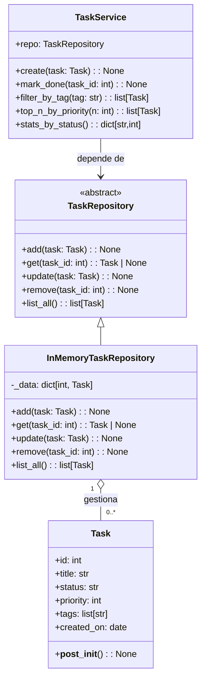

# 9. Ejemplo Integrador — TaskFlow + EduEnroll

> **Objetivo:** ver **todos los conceptos del curso** trabajando juntos en dos sistemas completos.

Este archivo contiene dos ejemplos integradores de complejidad creciente:

| # | Sistema | Conceptos principales |
|---|---------|----------------------|
| A | **TaskFlow** (4 clases) | Dataclass, ABC, DI/DIP, comprehensions |
| B | **EduEnroll** (sistema completo) | Dataclass, ABC, Protocol, DI/DIP, comprehensions, reglas de precio |

---

## Mapa de conceptos aplicados

| Concepto del curso | TaskFlow | EduEnroll |
|--------------------|----------|-----------|
| **Clases y atributos** | `Task`, `TaskService` | `Student`, `Course`, `Enrollment` |
| **Dataclasses** | `@dataclass(slots=True)` con validación | `@dataclass` con `field(default_factory=...)` |
| **Herencia (ABC)** | `TaskRepository` → `InMemoryTaskRepository` | `StudentRepository`, `EnrollmentRepository` |
| **Protocol** | — | `Notifier`, `PricingRule` |
| **Polimorfismo** | `list_all()` funciona con cualquier repo | `send()` funciona con Email/SMS; `price_for()` con múltiples reglas |
| **DI (inyección)** | `TaskService(repo)` | `EnrollmentService(student_repo, enrollment_repo, notifier, pricing)` |
| **DIP (inversión)** | Servicio depende de `TaskRepository` (ABC) | Servicio depende de ABCs + Protocols |
| **Comprehensions** | Filtros, rankings, estadísticas | Totales por categoría, top estudiantes, formato |
| **Dict comprehension** | `stats_by_status()` | `total_by_cat`, `spent_by_student` |
| **Modularización** | Separación entidad/contrato/impl/servicio | Separación por capas (dominio, persistencia, servicios) |

---

# Parte A — TaskFlow

**4 clases** para gestionar tareas con **dataclass + ABC + DI/DIP + comprehensions**.

```python
from dataclasses import dataclass, field
from abc import ABC, abstractmethod
from datetime import date

# =============== 1) ENTIDAD ==================

@dataclass(slots=True)
class Task:
    id: int
    title: str
    status: str = "todo"            # "todo" | "doing" | "done"
    priority: int = 3               # 1=alta, 2=media, 3=baja
    tags: list[str] = field(default_factory=list)
    created_on: date = field(default_factory=date.today)

    def __post_init__(self) -> None:
        if not self.title.strip():
            raise ValueError("title vacío")
        if self.status not in {"todo", "doing", "done"}:
            raise ValueError("status inválido")
        if self.priority not in {1, 2, 3}:
            raise ValueError("priority debe ser 1, 2 o 3")
        self.tags = [t.strip() for t in self.tags if t.strip()]

# =============== 2) CONTRATO (ABC) ============

class TaskRepository(ABC):
    @abstractmethod
    def add(self, task: Task) -> None: ...
    @abstractmethod
    def get(self, task_id: int) -> Task | None: ...
    @abstractmethod
    def update(self, task: Task) -> None: ...
    @abstractmethod
    def remove(self, task_id: int) -> None: ...
    @abstractmethod
    def list_all(self) -> list[Task]: ...

# =============== 3) IMPLEMENTACIÓN ============

class InMemoryTaskRepository(TaskRepository):
    def __init__(self) -> None:
        self._data: dict[int, Task] = {}

    def add(self, task: Task) -> None:
        if task.id in self._data:
            raise ValueError(f"ID duplicado: {task.id}")
        self._data[task.id] = task

    def get(self, task_id: int) -> Task | None:
        return self._data.get(task_id)

    def update(self, task: Task) -> None:
        if task.id not in self._data:
            raise ValueError(f"No existe task {task.id}")
        self._data[task.id] = task

    def remove(self, task_id: int) -> None:
        if task_id not in self._data:
            raise ValueError(f"No existe task {task_id}")
        del self._data[task_id]

    def list_all(self) -> list[Task]:
        return list(self._data.values())

# =============== 4) SERVICIO (DIP + DI) =======

class TaskService:
    """
    Orquesta casos de uso.
    Depende del CONTRATO TaskRepository (DIP) e inyectamos la implementación (DI).
    """
    def __init__(self, repo: TaskRepository) -> None:
        self.repo = repo

    def create(self, task: Task) -> None:
        self.repo.add(task)

    def mark_done(self, task_id: int) -> None:
        t = self.repo.get(task_id)
        if t is None:
            raise ValueError("task no encontrada")
        t.status = "done"
        self.repo.update(t)

    def filter_by_tag(self, tag: str) -> list[Task]:
        needle = tag.lower().strip()
        return [t for t in self.repo.list_all() if needle in (x.lower() for x in t.tags)]

    def top_n_by_priority(self, n: int) -> list[Task]:
        return sorted(self.repo.list_all(), key=lambda t: t.priority)[:max(0, n)]

    def stats_by_status(self) -> dict[str, int]:
        statuses = {"todo", "doing", "done"}
        tasks = self.repo.list_all()
        return {s: sum(1 for t in tasks if t.status == s) for s in statuses}

# =============== DEMO =========================

if __name__ == "__main__":
    repo = InMemoryTaskRepository()
    svc = TaskService(repo)

    svc.create(Task(1, "Instalar Python", tags=["setup", "python"], priority=1))
    svc.create(Task(2, "Leer PEPs", tags=["python", "reading"], priority=2))
    svc.create(Task(3, "Practicar dataclasses", tags=["python", "poo"], priority=1))
    svc.create(Task(4, "Commit inicial", tags=["git"], priority=3, status="doing"))

    svc.mark_done(1)

    print("Todas:")
    for t in svc.repo.list_all():
        print(" -", t)

    print("\nPor tag 'python':", [t.title for t in svc.filter_by_tag("python")])
    print("Top 2 por prioridad:", [t.title for t in svc.top_n_by_priority(2)])
    print("Stats:", svc.stats_by_status())
```

### Diagrama de clases — TaskFlow



---

# Parte B — EduEnroll (Plataforma de matrículas)

Sistema completo que combina **ABC**, **Protocol**, **DI/DIP**, **dataclasses** y **comprehensions** en un solo ejemplo.


### Piezas del dominio

| Tipo | Clases | Patrón |
|------|--------|--------|
| Entidades (`@dataclass`) | `Student`, `Course`, `Enrollment` | Datos + validación |
| ABC (nominales) | `StudentRepository`, `EnrollmentRepository` | Contrato de persistencia |
| Protocol (estructurales) | `Notifier`, `PricingRule` | Contrato ligero |
| Implementaciones | `InMemoryStudentRepo`, `InMemoryEnrollmentRepo`, `EmailNotifier`, `SMSNotifier`, `BasePriceRule`, `CategoryDiscountRule`, `ComboRule` | Detalles concretos |
| Servicio | `EnrollmentService` | Orquesta sin conocer detalles |

```python
from dataclasses import dataclass, field
from typing import Protocol
from abc import ABC, abstractmethod
from datetime import date

# =============== ENTIDADES (Dataclasses) ===============

@dataclass
class Student:
    id: int
    name: str
    email: str

@dataclass
class Course:
    id: int
    title: str
    category: str               # p.ej. "CS", "MATH", "AI"
    base_price: float

    def __post_init__(self) -> None:
        if self.base_price <= 0:
            raise ValueError("base_price debe ser > 0")

@dataclass
class Enrollment:
    id: int
    student_id: int
    course_id: int
    enrolled_on: date = field(default_factory=date.today)
    paid_amount: float = 0.0


# =============== ABC: Repositorios nominales ===============

class StudentRepository(ABC):
    """Contrato de persistencia para estudiantes."""
    @abstractmethod
    def add(self, student: Student) -> None: ...
    @abstractmethod
    def get(self, student_id: int) -> Student | None: ...
    @abstractmethod
    def list_all(self) -> list[Student]: ...

class EnrollmentRepository(ABC):
    """Contrato de persistencia para matrículas."""
    @abstractmethod
    def add(self, enrollment: Enrollment) -> None: ...
    @abstractmethod
    def next_id(self) -> int: ...
    @abstractmethod
    def list_by_student(self, student_id: int) -> list[Enrollment]: ...
    @abstractmethod
    def list_all(self) -> list[Enrollment]: ...


# =============== Protocolos (interfaces estructurales) ===============

class Notifier(Protocol):
    """Cualquier objeto con send(to, subject, body) es un Notifier."""
    def send(self, to: str, subject: str, body: str) -> None: ...

class PricingRule(Protocol):
    """Cualquier objeto con price_for(course) es una regla de precio."""
    def price_for(self, course: Course) -> float: ...


# =============== Implementaciones de repos ===============

class InMemoryStudentRepo(StudentRepository):
    def __init__(self) -> None:
        self._data: dict[int, Student] = {}

    def add(self, student: Student) -> None:
        self._data[student.id] = student

    def get(self, student_id: int) -> Student | None:
        return self._data.get(student_id)

    def list_all(self) -> list[Student]:
        return list(self._data.values())

class InMemoryEnrollmentRepo(EnrollmentRepository):
    def __init__(self) -> None:
        self._data: list[Enrollment] = []

    def add(self, enrollment: Enrollment) -> None:
        self._data.append(enrollment)

    def next_id(self) -> int:
        return len(self._data) + 1

    def list_by_student(self, student_id: int) -> list[Enrollment]:
        return [e for e in self._data if e.student_id == student_id]

    def list_all(self) -> list[Enrollment]:
        return list(self._data)


# =============== Implementaciones de Protocolos ===============

class EmailNotifier:
    def __init__(self, sender: str = "no-reply@university.edu") -> None:
        self.sender = sender

    def send(self, to: str, subject: str, body: str) -> None:
        print(f"[EMAIL from {self.sender} → {to}] {subject}\n{body}\n")

class SMSNotifier:
    def __init__(self, provider: str = "Twilio") -> None:
        self.provider = provider

    def send(self, to: str, subject: str, body: str) -> None:
        print(f"[SMS via {self.provider} → {to}] {body}\n")


# =============== Reglas de precio (componibles) ===============

class BasePriceRule:
    """Precio base del curso (sin descuentos)."""
    def price_for(self, course: Course) -> float:
        return course.base_price

class CategoryDiscountRule:
    """Aplica descuento por categoría (p.ej. AI: 10%, MATH: 5%)."""
    def __init__(self, discounts: dict[str, float]) -> None:
        self.discounts = discounts

    def price_for(self, course: Course) -> float:
        d = self.discounts.get(course.category, 0.0)
        return course.base_price * (1 - d)

class ComboRule:
    """Combina varias reglas y toma el menor precio (mejor oferta)."""
    def __init__(self, rules: list[PricingRule]) -> None:
        self.rules = rules

    def price_for(self, course: Course) -> float:
        prices = [r.price_for(course) for r in self.rules]
        return min(prices) if prices else course.base_price


# =============== Servicio de aplicación (DIP + DI) ===============

class EnrollmentService:
    """
    Orquesta la matrícula:
      - Depende de ABC (repos) y Protocols (Notifier, PricingRule)
      - Se configura por inyección de dependencias
    """
    def __init__(
        self,
        student_repo: StudentRepository,
        enrollment_repo: EnrollmentRepository,
        notifier: Notifier,
        pricing: PricingRule,
    ) -> None:
        self.student_repo = student_repo
        self.enrollment_repo = enrollment_repo
        self.notifier = notifier
        self.pricing = pricing

    def enroll(self, student_id: int, course: Course) -> Enrollment:
        student = self.student_repo.get(student_id)
        if student is None:
            raise ValueError(f"Student {student_id} not found")

        enrollment_id = self.enrollment_repo.next_id()
        price = self.pricing.price_for(course)

        enrollment = Enrollment(
            id=enrollment_id,
            student_id=student.id,
            course_id=course.id,
            paid_amount=price,
        )
        self.enrollment_repo.add(enrollment)

        subject = f"Matriculado en {course.title}"
        body = (
            f"Hola {student.name},\n"
            f"Has sido matriculado en '{course.title}' ({course.category}).\n"
            f"Total pagado: ${price:.2f}.\n"
            f"Fecha: {enrollment.enrolled_on.isoformat()}"
        )
        self.notifier.send(student.email, subject, body)

        return enrollment


# =============== DEMO (ensamblaje por inyección) ===============

if __name__ == "__main__":
    students: list[Student] = [
        Student(1, "Ana", "ana@uni.edu"),
        Student(2, "Luis", "luis@uni.edu"),
        Student(3, "Sofía", "sofia@uni.edu"),
    ]

    courses: list[Course] = [
        Course(101, "Intro a Programación", "CS", 120.0),
        Course(102, "Cálculo I", "MATH", 150.0),
        Course(201, "Introducción a IA", "AI", 220.0),
        Course(202, "Álgebra Lineal", "MATH", 180.0),
    ]

    # --- Ensamblar dependencias ---
    srepo = InMemoryStudentRepo()
    erepo = InMemoryEnrollmentRepo()
    for s in students:
        srepo.add(s)

    notifier: Notifier = EmailNotifier(sender="secretaria@uni.edu")
    base_rule = BasePriceRule()
    cat_rule = CategoryDiscountRule(discounts={"AI": 0.15, "MATH": 0.05})
    pricing: PricingRule = ComboRule([base_rule, cat_rule])

    service = EnrollmentService(srepo, erepo, notifier, pricing)

    # --- Matricular ---
    e1 = service.enroll(1, courses[0])
    e2 = service.enroll(2, courses[2])
    e3 = service.enroll(3, courses[1])
    e4 = service.enroll(1, courses[3])

    # --- Reportes con comprehensions ---
    course_index: dict[int, Course] = {c.id: c for c in courses}
    all_enrolls = erepo.list_all()

    # Total por categoría (dict comprehension)
    cats = {course_index[e.course_id].category for e in all_enrolls}
    total_by_cat: dict[str, float] = {
        cat: sum(
            e.paid_amount
            for e in all_enrolls
            if course_index[e.course_id].category == cat
        )
        for cat in cats
    }

    # Top estudiantes por gasto
    spent_by_student: dict[int, float] = {}
    for e in all_enrolls:
        spent_by_student[e.student_id] = spent_by_student.get(e.student_id, 0.0) + e.paid_amount
    top_students = sorted(
        spent_by_student.items(), key=lambda kv: kv[1], reverse=True
    )[:3]

    # --- Imprimir resultados ---
    def fmt_enrollment(e: Enrollment) -> str:
        s = srepo.get(e.student_id)
        c = course_index[e.course_id]
        name = s.name if s else f"#{e.student_id}"
        return f"[{e.id}] {name} → {c.title} ({c.category}) = ${e.paid_amount:.2f}"

    print("=== MATRÍCULAS ===")
    for e in all_enrolls:
        print(" •", fmt_enrollment(e))

    print("\n=== TOTAL POR CATEGORÍA ===")
    for cat, total in total_by_cat.items():
        print(f" - {cat}: ${total:.2f}")

    print("\n=== TOP ESTUDIANTES POR GASTO ===")
    for sid, total in top_students:
        s = srepo.get(sid)
        print(f" - {(s.name if s else f'#{sid}')}: ${total:.2f}")
```
---


