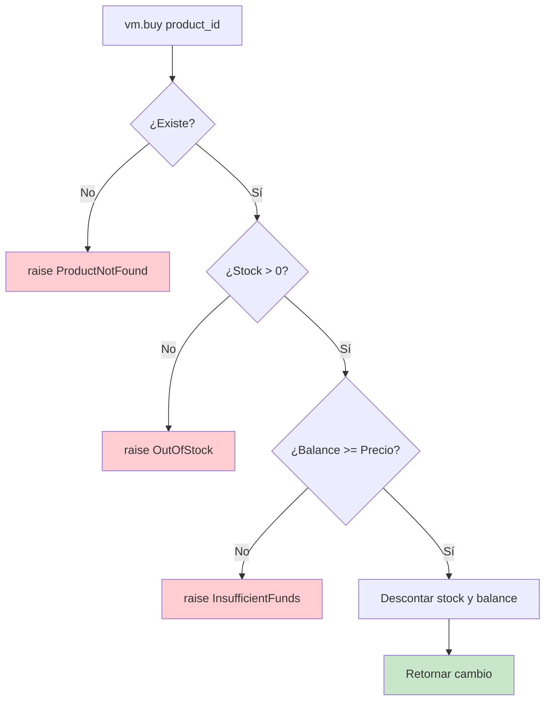

# 8. Manejo de Excepciones

> **Tema de teoría:** [`teoria/7. manejo_de_excepciones.md`](../teoria/7.%20manejo_de_excepciones.md)

**Objetivo:** dominar el manejo de excepciones en Python: jerarquía personalizada, `try/except/else/finally`, `raise`/`raise from`, LBYL vs EAFP, y context managers.

---

## Dominio: Máquina expendedora

Una máquina expendedora de snacks que debe manejar múltiples condiciones de error:
producto no encontrado, sin stock, fondos insuficientes, montos inválidos.

> Este ejemplo se enfoca en el **manejo de errores**. Para la estructura de paquete, ver [`ejemplos/7. modulos_y_paquetes.md`](7.%20modulos_y_paquetes.md).

---

## Parte 1 — Jerarquía de excepciones del dominio

```python
"""Excepciones del dominio para la máquina expendedora."""


class DomainError(Exception):
    """Base de todos los errores del dominio.
    Atrapar DomainError captura cualquier error de negocio."""
    pass


class InvalidAmount(DomainError):
    """Montos inválidos (negativos o cero)."""
    pass


class InvalidProduct(DomainError):
    """Datos inválidos para crear un Product (id vacío, precio <= 0)."""
    pass


class ProductNotFound(DomainError):
    """El product_id no existe en el catálogo."""
    pass


class OutOfStock(DomainError):
    """El producto existe pero su stock es 0."""
    pass


class InsufficientFunds(DomainError):
    """El balance es menor que el precio del producto."""
    pass


class DuplicateProduct(DomainError):
    """Se intenta registrar un producto ya existente."""
    pass
```

### 💡 Por qué una jerarquía

```text
Exception
 └── DomainError           ← base del dominio
      ├── InvalidAmount
      ├── InvalidProduct
      ├── ProductNotFound
      ├── OutOfStock
      ├── InsufficientFunds
      └── DuplicateProduct
```

- Atrapar `DomainError` captura **cualquier** error de negocio.
- Atrapar `OutOfStock` captura **solo** ese caso específico.
- Nunca usamos `Exception` genérica para errores de negocio.

---

## Parte 2 — Entidad con validación (`raise`)

```python
from dataclasses import dataclass


@dataclass(frozen=True)
class Product:
    """Producto vendible (precio en centavos)."""
    id: str
    name: str
    price: int  # > 0

    def __post_init__(self) -> None:
        if not self.id or self.id.strip() == "":
            raise InvalidProduct("El id de producto no puede ser vacío.")
        if self.price <= 0:
            raise InvalidProduct("El precio debe ser un entero positivo (centavos).")
```

- `raise` lanza la excepción **inmediatamente** si la validación falla.
- `frozen=True` hace que el producto sea inmutable (no se puede modificar después).
- `__post_init__` se ejecuta al final de `__init__` en dataclasses.

---

## Parte 3 — Lógica de negocio con excepciones

```python
class VendingMachine:
    """Gestiona catálogo, stock, balance y operaciones."""

    def __init__(self) -> None:
        self._catalog: dict[str, Product] = {}
        self._stock: dict[str, int] = {}
        self._balance: int = 0  # centavos

    def _ensure_exists(self, product_id: str) -> Product:
        """Helper que lanza ProductNotFound si no existe."""
        product = self._catalog.get(product_id)
        if product is None:
            raise ProductNotFound(f"Producto '{product_id}' no existe.")
        return product

    def add_product(self, product: Product, stock: int) -> None:
        """Registra producto. Lanza DuplicateProduct o InvalidAmount."""
        if stock < 0:
            raise InvalidAmount("El stock inicial debe ser >= 0.")
        if product.id in self._catalog:
            raise DuplicateProduct(f"El producto '{product.id}' ya existe.")
        self._catalog[product.id] = product
        self._stock[product.id] = stock

    def insert(self, amount: int) -> None:
        """Inserta dinero. Lanza InvalidAmount si <= 0."""
        if amount <= 0:
            raise InvalidAmount("El monto insertado debe ser > 0.")
        self._balance += amount

    def buy(self, product_id: str) -> int:
        """
        Compra 1 unidad. Retorna el cambio.

        Puede lanzar:
          - ProductNotFound
          - OutOfStock
          - InsufficientFunds
        """
        product = self._ensure_exists(product_id)

        if self._stock[product_id] == 0:
            raise OutOfStock(f"No hay stock para '{product_id}'.")

        if self._balance < product.price:
            raise InsufficientFunds(
                f"Fondos insuficientes: balance={self._balance}, price={product.price}"
            )

        self._stock[product_id] -= 1
        self._balance -= product.price
        change = self._balance
        self._balance = 0
        return change

    def cancel(self) -> int:
        """Devuelve todo el balance y lo reinicia a 0."""
        amount = self._balance
        self._balance = 0
        return amount

    def balance(self) -> int:
        return self._balance

    def get_stock(self, product_id: str) -> int:
        self._ensure_exists(product_id)
        return self._stock[product_id]
```

---

## Parte 4 — `try/except/else/finally` en acción

```python
def demo_compra(vm: VendingMachine, product_id: str, monto: int) -> None:
    """Demuestra el flujo completo de manejo de excepciones."""
    print(f"\n--- Intentar comprar '{product_id}' con ${monto} ---")
    try:
        vm.insert(monto)
        change = vm.buy(product_id)
    except ProductNotFound as e:
        print(f"  ❌ Producto no encontrado: {e}")
    except OutOfStock as e:
        print(f"  ❌ Sin stock: {e}")
        # Devolver dinero si falla
        refund = vm.cancel()
        print(f"  💰 Reembolso: ${refund}")
    except InsufficientFunds as e:
        print(f"  ❌ Fondos insuficientes: {e}")
        refund = vm.cancel()
        print(f"  💰 Reembolso: ${refund}")
    except DomainError as e:
        # Atrapa cualquier otro error de dominio no previsto
        print(f"  ❌ Error de dominio: {e}")
    else:
        # Se ejecuta SOLO si no hubo excepción
        print(f"  ✅ Compra exitosa. Cambio: ${change}")
        print(f"  📦 Stock restante: {vm.get_stock(product_id)}")
    finally:
        # Se ejecuta SIEMPRE (con o sin excepción)
        print(f"  💳 Balance final: ${vm.balance()}")
```

### 💡 Flujo `try/except/else/finally`

```text
try:        → Código que puede fallar
except X:   → Maneja errores específicos (del más específico al más general)
else:       → Se ejecuta SOLO si NO hubo excepción
finally:    → Se ejecuta SIEMPRE (limpieza, cerrar recursos)
```

---

## Parte 5 — LBYL vs EAFP

```python
# LBYL (Look Before You Leap) — preguntar antes de actuar
def compra_lbyl(vm: VendingMachine, product_id: str) -> int | None:
    """Verifica condiciones ANTES de intentar la compra."""
    try:
        stock = vm.get_stock(product_id)
    except ProductNotFound:
        print("No existe")
        return None

    if stock == 0:
        print("Sin stock")
        return None

    # Aún podría fallar por fondos insuficientes...
    try:
        return vm.buy(product_id)
    except InsufficientFunds:
        print("Sin fondos")
        return None


# EAFP (Easier to Ask Forgiveness than Permission) — intentar y manejar el error
def compra_eafp(vm: VendingMachine, product_id: str) -> int | None:
    """Intenta directamente y maneja excepciones (estilo Pythónico)."""
    try:
        return vm.buy(product_id)
    except DomainError as e:
        print(f"Error: {e}")
        return None
```

| Estilo | Enfoque | Cuándo usar |
|--------|---------|-------------|
| **LBYL** | Verificar condiciones antes | Operaciones costosas/irreversibles |
| **EAFP** | Intentar y manejar error | Estilo Pythónico, operaciones seguras |

---

## Parte 6 — `raise from` (encadenar excepciones)

```python
def buscar_producto_externo(product_id: str) -> dict:
    """Simula búsqueda en servicio externo que puede fallar."""
    catalogo = {"X1": {"name": "Chips", "price": 500}}
    return catalogo[product_id]  # puede lanzar KeyError


def registrar_desde_externo(vm: VendingMachine, product_id: str, stock: int) -> None:
    """
    Usa raise from para encadenar la causa original.
    """
    try:
        datos = buscar_producto_externo(product_id)
    except KeyError as original:
        raise ProductNotFound(
            f"No se encontró '{product_id}' en el catálogo externo"
        ) from original  # ← encadena la causa

    product = Product(product_id, datos["name"], datos["price"])
    vm.add_product(product, stock)
```

```python
# Al ejecutar con un ID inválido:
# ProductNotFound: No se encontró 'Z9' en el catálogo externo
#
# The above exception was the direct cause of the following exception:
#   KeyError: 'Z9'
```

---

## Demo completa

```python
if __name__ == "__main__":
    vm = VendingMachine()

    # Registrar productos
    vm.add_product(Product("A1", "Agua", 800), stock=2)
    vm.add_product(Product("B2", "Barra energética", 1200), stock=1)
    vm.add_product(Product("C3", "Galletas", 600), stock=0)

    # Caso 1: compra exitosa
    demo_compra(vm, "A1", 1000)
    # → ✅ Compra exitosa. Cambio: $200

    # Caso 2: producto no encontrado
    demo_compra(vm, "Z9", 500)
    # → ❌ Producto no encontrado

    # Caso 3: sin stock
    demo_compra(vm, "C3", 1000)
    # → ❌ Sin stock + reembolso

    # Caso 4: fondos insuficientes
    demo_compra(vm, "B2", 500)
    # → ❌ Fondos insuficientes + reembolso

    # Caso 5: producto duplicado
    try:
        vm.add_product(Product("A1", "Agua duplicada", 900), stock=5)
    except DuplicateProduct as e:
        print(f"\n❌ Duplicado: {e}")

    # Caso 6: producto inválido
    try:
        Product("", "Sin ID", 100)
    except InvalidProduct as e:
        print(f"❌ Producto inválido: {e}")

    # Caso 7: raise from
    try:
        registrar_desde_externo(vm, "Z9", 10)
    except ProductNotFound as e:
        print(f"\n❌ Error encadenado: {e}")
        print(f"   Causa original: {e.__cause__}")
```

---

## Diagrama de flujo de excepciones



---

## Resumen de buenas prácticas

| Práctica | Ejemplo |
|----------|---------|
| Crear jerarquía de excepciones del dominio | `DomainError` → `OutOfStock` |
| Atrapar del más específico al más general | `except OutOfStock` antes de `except DomainError` |
| Usar `else` para código que solo corre sin error | Confirmar compra exitosa |
| Usar `finally` para limpieza | Mostrar balance final |
| Usar `raise from` al re-lanzar | Preservar causa original |
| Preferir EAFP en Python | `try/except` sobre `if/check` |
| Nunca atrapar `Exception` genérica en producción | Demasiado amplio, oculta bugs |

---

## Ejercicios

1. **Nueva excepción:** agrega `MaxBalanceExceeded(DomainError)` que se lance si el balance supera 10.000. Modifica `insert()`.
2. **Context manager:** crea un context manager `transaccion(vm)` que haga `cancel()` automáticamente si ocurre una excepción durante un bloque `with`.
3. **Logging:** modifica `demo_compra` para que registre en una lista `log: list[str]` cada resultado (éxito o error) en lugar de imprimir.
4. **EAFP vs LBYL:** reescribe `compra_lbyl` usando solo EAFP. ¿Cuántas líneas te ahorras?
5. **Exception groups (Python 3.11+):** investiga `ExceptionGroup` y escribe un ejemplo que agrupe múltiples errores de validación al registrar varios productos a la vez.

---

## Referencias

- Teoría: [`teoria/7. manejo_de_excepciones.md`](../teoria/7.%20manejo_de_excepciones.md)
- Modularización: [`ejemplos/4. modularizacion_y_abstraccion.md`](4.%20modularizacion_y_abstraccion.md)
- Módulos y paquetes: [`ejemplos/7. modulos_y_paquetes.md`](7.%20modulos_y_paquetes.md)
