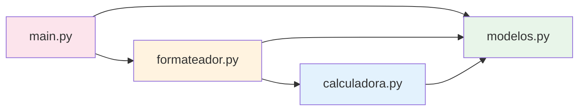

# 4. Modularización y Abstracción

> **Tema de teoría:** [`teoria/5. modularizacion_y_abstraccion.md`](../teoria/5.%20modularizacion_y_abstraccion.md)

**Objetivo:** transformar un script monolítico en un diseño modular aplicando **cohesión**, **separación de responsabilidades** y **abstracción** (ocultar detalles, exponer contratos).

---

## Dominio: Sistema de pedidos de restaurante

Un restaurante necesita gestionar pedidos: registrar platos, crear órdenes y calcular totales con impuestos.

---

## 🔴 ANTES — Todo en un solo archivo

```python
# monolito.py — acoplado, baja cohesión, difícil de mantener.

class Plato:
    def __init__(self, nombre: str, precio: float) -> None:
        if precio <= 0:
            raise ValueError("El precio debe ser positivo")
        self.nombre = nombre
        self.precio = precio

class Pedido:
    IMPUESTO: float = 0.19

    def __init__(self) -> None:
        self.items: list[tuple[Plato, int]] = []

    def agregar(self, plato: Plato, cantidad: int) -> None:
        if cantidad <= 0:
            raise ValueError("Cantidad debe ser > 0")
        self.items.append((plato, cantidad))

    def subtotal(self) -> float:
        return sum(p.precio * c for p, c in self.items)

    def total(self) -> float:
        return self.subtotal() * (1 + self.IMPUESTO)

    def resumen(self) -> str:
        lineas = [f"  {p.nombre} x{c} = ${p.precio * c:,.0f}" for p, c in self.items]
        lineas.append(f"  Subtotal: ${self.subtotal():,.0f}")
        lineas.append(f"  IVA {self.IMPUESTO:.0%}: ${self.subtotal() * self.IMPUESTO:,.0f}")
        lineas.append(f"  TOTAL: ${self.total():,.0f}")
        return "\n".join(lineas)

    # 👎 Además imprime directo (mezcla lógica + presentación)
    def imprimir_factura(self) -> None:
        print("=" * 40)
        print("  RESTAURANTE EL BUEN SABOR")
        print("=" * 40)
        print(self.resumen())
        print("=" * 40)


# --- Script principal (también aquí) ---
if __name__ == "__main__":
    p1 = Plato("Bandeja Paisa", 25_000)
    p2 = Plato("Limonada", 5_000)

    pedido = Pedido()
    pedido.agregar(p1, 2)
    pedido.agregar(p2, 3)
    pedido.imprimir_factura()
```

### Problemas

| Síntoma | Principio violado |
|---------|-------------------|
| `Pedido` calcula, formatea e imprime | SRP (responsabilidad única) |
| No puedo reutilizar `Plato` sin traer `Pedido` | Baja cohesión / alto acoplamiento |
| Agregar formato PDF obliga a modificar `Pedido` | OCP (abierto/cerrado) |
| No hay separación entre dominio y presentación | Separación de responsabilidades |

---

## 🟢 DESPUÉS — Diseño modular

### Estructura propuesta

```text
restaurante/
├── modelos.py        # Entidades del dominio (Plato, ItemPedido, Pedido)
├── calculadora.py    # Lógica de cálculo (subtotal, impuesto, total)
├── formateador.py    # Presentación (formato texto de la factura)
└── main.py           # Ensamblaje y ejecución
```

### `modelos.py` — Entidades del dominio

```python
"""Entidades del dominio: Plato, ItemPedido, Pedido."""

from dataclasses import dataclass, field


@dataclass(frozen=True)
class Plato:
    """Un plato del menú."""
    nombre: str
    precio: float  # > 0

    def __post_init__(self) -> None:
        if self.precio <= 0:
            raise ValueError("El precio debe ser positivo")


@dataclass
class ItemPedido:
    """Línea dentro de un pedido."""
    plato: Plato
    cantidad: int  # > 0

    def __post_init__(self) -> None:
        if self.cantidad <= 0:
            raise ValueError("Cantidad debe ser > 0")

    @property
    def valor(self) -> float:
        """Precio × cantidad."""
        return self.plato.precio * self.cantidad


@dataclass
class Pedido:
    """Colección ordenada de ítems."""
    items: list[ItemPedido] = field(default_factory=list)

    def agregar(self, plato: Plato, cantidad: int) -> None:
        self.items.append(ItemPedido(plato, cantidad))
```

### `calculadora.py` — Lógica de cálculo

```python
"""Funciones puras de cálculo sobre pedidos."""

from .modelos import Pedido

TASA_IMPUESTO: float = 0.19


def subtotal(pedido: Pedido) -> float:
    """Suma de precio × cantidad de cada ítem."""
    return sum(item.valor for item in pedido.items)


def impuesto(pedido: Pedido) -> float:
    """Monto del impuesto (IVA)."""
    return subtotal(pedido) * TASA_IMPUESTO


def total(pedido: Pedido) -> float:
    """Subtotal + impuesto."""
    return subtotal(pedido) + impuesto(pedido)
```

### `formateador.py` — Presentación

```python
"""Formatea la factura como texto plano."""

from .modelos import Pedido
from .calculadora import subtotal, impuesto, total


def factura_texto(pedido: Pedido, nombre_restaurante: str = "EL BUEN SABOR") -> str:
    """Genera factura como string (no imprime, solo retorna)."""
    ancho = 40
    lineas: list[str] = [
        "=" * ancho,
        f"  {nombre_restaurante}".center(ancho),
        "=" * ancho,
    ]

    for item in pedido.items:
        lineas.append(f"  {item.plato.nombre} x{item.cantidad} = ${item.valor:,.0f}")

    lineas.append("-" * ancho)
    lineas.append(f"  Subtotal: ${subtotal(pedido):,.0f}")
    lineas.append(f"  IVA 19%:  ${impuesto(pedido):,.0f}")
    lineas.append(f"  TOTAL:    ${total(pedido):,.0f}")
    lineas.append("=" * ancho)

    return "\n".join(lineas)
```

### `main.py` — Ensamblaje

```python
"""Punto de entrada: python -m restaurante.main"""

from .modelos import Plato, Pedido
from .formateador import factura_texto


def main() -> None:
    p1 = Plato("Bandeja Paisa", 25_000)
    p2 = Plato("Limonada", 5_000)
    p3 = Plato("Postre de Natas", 8_000)

    pedido = Pedido()
    pedido.agregar(p1, 2)
    pedido.agregar(p2, 3)
    pedido.agregar(p3, 1)

    print(factura_texto(pedido))


if __name__ == "__main__":
    main()
```

**Salida esperada:**

```text
========================================
          EL BUEN SABOR
========================================
  Bandeja Paisa x2 = $50,000
  Limonada x3 = $15,000
  Postre de Natas x1 = $8,000
----------------------------------------
  Subtotal: $73,000
  IVA 19%:  $13,870
  TOTAL:    $86,870
========================================
```

---

## Diagrama de dependencias



Cada módulo tiene **una sola razón para cambiar**:

| Módulo | Responsabilidad | Cambia si… |
|--------|----------------|------------|
| `modelos` | Definir entidades | Cambian las reglas del dominio |
| `calculadora` | Cálculos de precio | Cambia la tasa de impuesto o fórmula |
| `formateador` | Presentación en texto | Se quiere otro formato (PDF, JSON) |
| `main` | Ensamblaje | Cambian los datos de prueba |

---

## 💡 Conceptos aplicados

| Concepto | Dónde se ve |
|----------|-------------|
| **Cohesión alta** | Cada módulo agrupa solo funciones relacionadas |
| **Acoplamiento bajo** | `calculadora` no importa `formateador` ni viceversa |
| **SRP** | Cada clase/módulo tiene una responsabilidad |
| **Abstracción** | `Pedido.agregar()` oculta la creación de `ItemPedido` |
| **Separación dominio/presentación** | `modelos` + `calculadora` vs `formateador` |

---

## Ejercicios

1. **Nuevo formato:** crea `formateador_json.py` que retorne la factura como `dict` serializable. No modifiques `calculadora.py`.
2. **Descuento:** agrega un parámetro opcional `descuento: float = 0.0` a `total()` sin romper los módulos existentes.
3. **Comprehension:** en `calculadora.py`, crea `desglose(pedido) -> dict[str, float]` que retorne `{nombre_plato: valor}` usando dict comprehension.
4. **Test mental:** si agregas un nuevo tipo de impuesto (propina obligatoria), ¿qué módulo cambiarías? ¿Se afectan los demás?

---

## Referencias

- Teoría: [`teoria/5. modularizacion_y_abstraccion.md`](../teoria/5.%20modularizacion_y_abstraccion.md)
- Módulos Python: [`ejemplos/7. modulos_y_paquetes.md`](7.%20modulos_y_paquetes.md)
- Excepciones: [`ejemplos/8. manejo_de_excepciones.md`](8.%20manejo_de_excepciones.md)
