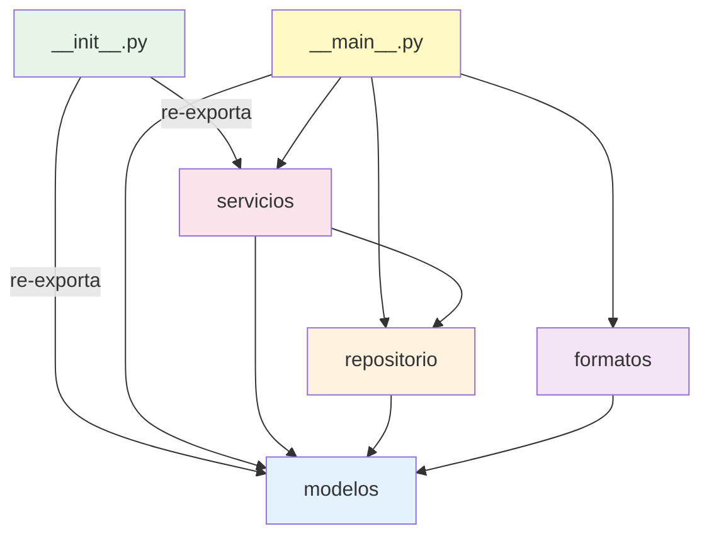

# 7. Módulos y Paquetes en Python

> **Tema de teoría:** [`teoria/6. modulos_y_paquetes_en_python.md`](../teoria/6.%20modulos_y_paquetes_en_python.md)

**Objetivo:** dominar los mecanismos de **importación** de Python: módulos, paquetes, `__init__.py`, imports relativos/absolutos, `__name__`, `__main__` y `__all__`.

---

## Dominio: Aplicación de contactos

Una agenda de contactos organizada como paquete Python con sub-módulos.

### Estructura del proyecto

```text
contactos_app/
├── pyproject.toml        # (opcional) metadata del proyecto
├── README.md
└── contactos/            # ← paquete principal
    ├── __init__.py       # marca contactos/ como paquete
    ├── modelos.py        # entidades
    ├── repositorio.py    # persistencia en memoria
    ├── servicios.py      # lógica de negocio
    ├── formatos.py       # exportación (vCard, CSV)
    └── __main__.py       # python -m contactos
```

---

## Paso 1 — `__init__.py`: definir el paquete

```python
# contactos/__init__.py

"""Paquete principal de gestión de contactos."""

# Re-exportamos las piezas más usadas para simplificar imports externos
from .modelos import Contacto
from .servicios import ServicioContactos

__all__ = ["Contacto", "ServicioContactos"]
```

### 💡 Puntos clave

- `__init__.py` convierte una carpeta en un **paquete** importable.
- `from .modelos import Contacto` → **import relativo** (el `.` significa "este paquete").
- `__all__` controla qué se exporta con `from contactos import *`.

---

## Paso 2 — `modelos.py`: entidades del dominio

```python
# contactos/modelos.py

"""Entidades del dominio."""

from dataclasses import dataclass, field


@dataclass
class Contacto:
    """Un contacto de la agenda."""
    id: int
    nombre: str
    email: str
    telefono: str = ""
    etiquetas: list[str] = field(default_factory=list)

    def __post_init__(self) -> None:
        if not self.nombre.strip():
            raise ValueError("El nombre no puede estar vacío")
        if "@" not in self.email:
            raise ValueError(f"Email inválido: {self.email}")
```

---

## Paso 3 — `repositorio.py`: persistencia (import relativo)

```python
# contactos/repositorio.py

"""Repositorio en memoria para contactos."""

from .modelos import Contacto  # ← import relativo


class RepositorioContactos:
    """Almacena contactos en un diccionario (en memoria)."""

    def __init__(self) -> None:
        self._datos: dict[int, Contacto] = {}

    def agregar(self, contacto: Contacto) -> None:
        if contacto.id in self._datos:
            raise ValueError(f"ID duplicado: {contacto.id}")
        self._datos[contacto.id] = contacto

    def obtener(self, contacto_id: int) -> Contacto | None:
        return self._datos.get(contacto_id)

    def listar(self) -> list[Contacto]:
        return list(self._datos.values())

    def eliminar(self, contacto_id: int) -> None:
        if contacto_id not in self._datos:
            raise KeyError(f"No existe contacto {contacto_id}")
        del self._datos[contacto_id]

    def buscar_por_etiqueta(self, etiqueta: str) -> list[Contacto]:
        """List comprehension con filtro."""
        tag = etiqueta.lower()
        return [c for c in self._datos.values() if tag in (e.lower() for e in c.etiquetas)]
```

---

## Paso 4 — `servicios.py`: lógica de negocio

```python
# contactos/servicios.py

"""Servicio de aplicación (orquesta casos de uso)."""

from .modelos import Contacto        # import relativo
from .repositorio import RepositorioContactos  # import relativo


class ServicioContactos:
    """Casos de uso de la agenda."""

    def __init__(self, repo: RepositorioContactos) -> None:
        self.repo = repo
        self._next_id: int = 1

    def crear(self, nombre: str, email: str, telefono: str = "", etiquetas: list[str] | None = None) -> Contacto:
        contacto = Contacto(
            id=self._next_id,
            nombre=nombre,
            email=email,
            telefono=telefono,
            etiquetas=etiquetas or [],
        )
        self.repo.agregar(contacto)
        self._next_id += 1
        return contacto

    def buscar(self, etiqueta: str) -> list[Contacto]:
        return self.repo.buscar_por_etiqueta(etiqueta)

    def exportar_nombres(self) -> list[str]:
        """List comprehension → solo nombres."""
        return [c.nombre for c in self.repo.listar()]

    def estadisticas(self) -> dict[str, int]:
        """Dict comprehension → contactos por etiqueta."""
        todos = self.repo.listar()
        todas_etiquetas = {e for c in todos for e in c.etiquetas}
        return {
            et: sum(1 for c in todos if et in c.etiquetas)
            for et in todas_etiquetas
        }
```

---

## Paso 5 — `formatos.py`: exportación

```python
# contactos/formatos.py

"""Funciones de exportación (vCard simplificado, CSV)."""

from .modelos import Contacto  # import relativo


def a_vcard(contacto: Contacto) -> str:
    """Genera formato vCard simplificado."""
    return (
        "BEGIN:VCARD\n"
        "VERSION:3.0\n"
        f"FN:{contacto.nombre}\n"
        f"EMAIL:{contacto.email}\n"
        f"TEL:{contacto.telefono}\n"
        "END:VCARD"
    )


def a_csv(contactos: list[Contacto]) -> str:
    """Genera CSV con cabecera."""
    lineas = ["id,nombre,email,telefono,etiquetas"]
    for c in contactos:
        tags = ";".join(c.etiquetas)
        lineas.append(f"{c.id},{c.nombre},{c.email},{c.telefono},{tags}")
    return "\n".join(lineas)
```

---

## Paso 6 — `__main__.py`: punto de entrada con `python -m`

```python
# contactos/__main__.py

"""Punto de entrada: python -m contactos"""

from .modelos import Contacto
from .repositorio import RepositorioContactos
from .servicios import ServicioContactos
from .formatos import a_vcard, a_csv


def main() -> None:
    repo = RepositorioContactos()
    svc = ServicioContactos(repo)

    # Crear contactos
    svc.crear("Ana García", "ana@udem.edu", "300-111", ["amigo", "universidad"])
    svc.crear("Luis Pérez", "luis@empresa.co", "311-222", ["trabajo"])
    svc.crear("Sofía Ríos", "sofia@udem.edu", "320-333", ["universidad", "estudio"])

    # Listar
    print("=== TODOS LOS CONTACTOS ===")
    for c in repo.listar():
        print(f"  [{c.id}] {c.nombre} <{c.email}> {c.etiquetas}")

    # Buscar por etiqueta
    print("\n=== BUSCAR 'universidad' ===")
    for c in svc.buscar("universidad"):
        print(f"  {c.nombre}")

    # Estadísticas (dict comprehension)
    print("\n=== ESTADÍSTICAS ===")
    for tag, count in svc.estadisticas().items():
        print(f"  {tag}: {count}")

    # Exportar
    print("\n=== VCARD (primer contacto) ===")
    print(a_vcard(repo.listar()[0]))

    print("\n=== CSV ===")
    print(a_csv(repo.listar()))


if __name__ == "__main__":
    main()
```

### Cómo ejecutar

```bash
# Desde la carpeta contactos_app/
python -m contactos
```

> `python -m contactos` busca `contactos/__main__.py` y lo ejecuta. Los imports relativos (`from .modelos import ...`) funcionan porque Python reconoce `contactos` como paquete.

---

## Mecánicas de importación explicadas

### Import relativo vs absoluto

```python
# RELATIVO (dentro del paquete) ← preferido dentro de paquetes
from .modelos import Contacto          # mismo nivel
from .repositorio import RepositorioContactos

# ABSOLUTO (desde fuera o dentro)
from contactos.modelos import Contacto
from contactos.servicios import ServicioContactos
```

| Tipo | Sintaxis | Cuándo usar |
|------|----------|-------------|
| Relativo | `from .modulo import X` | Dentro del mismo paquete |
| Absoluto | `from paquete.modulo import X` | Desde fuera o scripts independientes |

### `__name__` y `__main__`

```python
# Si ejecutas: python -m contactos
#   → contactos/__main__.py se ejecuta
#   → __name__ == "__main__"

# Si ejecutas: python contactos/modelos.py (¡NO recomendado!)
#   → __name__ == "__main__" pero los imports relativos fallan
```

### `__all__` — controlar `import *`

```python
# En __init__.py:
__all__ = ["Contacto", "ServicioContactos"]

# Desde fuera:
from contactos import *  # solo importa Contacto y ServicioContactos
```

---

## Diagrama de imports



---

## Errores comunes

| Error | Causa | Solución |
|-------|-------|----------|
| `ImportError: attempted relative import with no known parent package` | Ejecutaste `python modelos.py` directamente | Usa `python -m contactos` |
| `ModuleNotFoundError: No module named 'contactos'` | No estás en el directorio correcto | Ejecuta desde `contactos_app/` |
| `ImportError: cannot import name 'X'` | Nombre mal escrito o circular import | Revisa el nombre y elimina ciclos |

---

## Ejercicios

1. **Nuevo módulo:** crea `contactos/validaciones.py` con una función `validar_telefono(tel: str) -> bool` y úsala en `Contacto.__post_init__()` con import relativo.
2. **Sub-paquete:** crea `contactos/exportadores/` con `__init__.py`, `vcard.py` y `csv_export.py`. Mueve las funciones de `formatos.py` allí.
3. **`__all__`:** actualiza `__init__.py` para re-exportar también `RepositorioContactos`. Verifica con `from contactos import *`.
4. **Import absoluto:** desde un script `app.py` **fuera** del paquete, importa `ServicioContactos` con import absoluto y ejecuta una demo.
5. **Circular import:** intenta que `modelos.py` importe algo de `servicios.py`. ¿Qué pasa? ¿Cómo lo resolverías?

---

## Referencias

- Teoría: [`teoria/6. modulos_y_paquetes_en_python.md`](../teoria/6.%20modulos_y_paquetes_en_python.md)
- Modularización: [`ejemplos/4. modularizacion_y_abstraccion.md`](4.%20modularizacion_y_abstraccion.md)
- Excepciones: [`ejemplos/8. manejo_de_excepciones.md`](8.%20manejo_de_excepciones.md)
