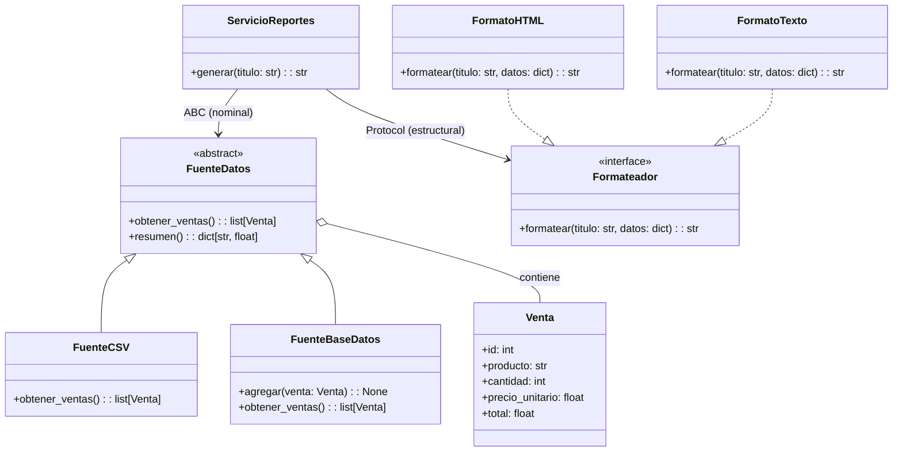

# 5. Protocolos e Interfaces

> **Tema de teoría:** [`teoria/5.2 protocolos_e_interfaces.md`](../teoria/5.2%20protocolos_e_interfaces.md)

**Objetivo:** entender la diferencia entre **ABC** (contrato nominal — herencia explícita) y **Protocol** (contrato estructural — duck typing estático). Aprender cuándo usar cada uno.

---

## Dominio: Sistema de reportes de ventas

Una empresa genera reportes de ventas. Necesita:
- **Fuentes de datos** intercambiables (CSV, base de datos, API).
- **Formatos de salida** intercambiables (texto, HTML).
- El servicio de reportes no debe conocer ningún detalle concreto.

---

## Parte 1 — Contrato con ABC: fuente de datos

Usamos **ABC** porque queremos garantizar herencia explícita y podemos tener **lógica común** (método `resumen()`).

```python
from abc import ABC, abstractmethod
from dataclasses import dataclass


@dataclass(frozen=True)
class Venta:
    """Registro de una venta."""
    id: int
    producto: str
    cantidad: int
    precio_unitario: float

    @property
    def total(self) -> float:
        return self.cantidad * self.precio_unitario


class FuenteDatos(ABC):
    """Contrato NOMINAL para obtener ventas."""

    @abstractmethod
    def obtener_ventas(self) -> list[Venta]: ...

    # Lógica común: cualquier fuente puede generar un resumen
    def resumen(self) -> dict[str, float]:
        """Total vendido por producto (dict comprehension)."""
        ventas = self.obtener_ventas()
        productos = {v.producto for v in ventas}
        return {
            p: sum(v.total for v in ventas if v.producto == p)
            for p in productos
        }


class FuenteCSV(FuenteDatos):
    """Simula lectura de un archivo CSV."""

    def __init__(self, datos: list[Venta]) -> None:
        self._datos = datos

    def obtener_ventas(self) -> list[Venta]:
        return list(self._datos)


class FuenteBaseDatos(FuenteDatos):
    """Simula lectura desde una base de datos."""

    def __init__(self) -> None:
        self._registros: list[Venta] = []

    def agregar(self, venta: Venta) -> None:
        self._registros.append(venta)

    def obtener_ventas(self) -> list[Venta]:
        return list(self._registros)
```

### 💡 Por qué ABC aquí

- `resumen()` es **lógica compartida** → no queremos repetirla en cada fuente.
- La herencia explícita (`class FuenteCSV(FuenteDatos)`) deja claro el contrato.
- Si alguien olvida implementar `obtener_ventas()`, Python lanza `TypeError` al instanciar.

```python
# Error en tiempo de ejecución si falta el método abstracto:
class FuenteIncompleta(FuenteDatos):
    pass

# f = FuenteIncompleta()  # → TypeError: Can't instantiate abstract class
```

---

## Parte 2 — Contrato con Protocol: formato de salida

Usamos **Protocol** porque solo necesitamos un contrato mínimo y **no hay lógica común**.

```python
from typing import Protocol


class Formateador(Protocol):
    """Contrato ESTRUCTURAL: cualquier objeto con formatear() es válido."""

    def formatear(self, titulo: str, datos: dict[str, float]) -> str: ...


# --- Implementaciones (NO heredan de Formateador) ---

class FormatoTexto:
    """Formato tabla de texto plano."""

    def formatear(self, titulo: str, datos: dict[str, float]) -> str:
        lineas = [titulo, "-" * 40]
        for producto, total in datos.items():
            lineas.append(f"  {producto:<20} ${total:>10,.0f}")
        lineas.append("-" * 40)
        gran_total = sum(datos.values())
        lineas.append(f"  {'TOTAL':<20} ${gran_total:>10,.0f}")
        return "\n".join(lineas)


class FormatoHTML:
    """Formato tabla HTML."""

    def formatear(self, titulo: str, datos: dict[str, float]) -> str:
        filas = "".join(
            f"<tr><td>{p}</td><td>${t:,.0f}</td></tr>" for p, t in datos.items()
        )
        gran_total = sum(datos.values())
        return (
            f"<h2>{titulo}</h2>"
            f"<table><tr><th>Producto</th><th>Total</th></tr>"
            f"{filas}"
            f"<tr><td><b>TOTAL</b></td><td><b>${gran_total:,.0f}</b></td></tr>"
            f"</table>"
        )
```

### 💡 Por qué Protocol aquí

- No hay lógica compartida entre formatos.
- Las clases **no necesitan heredar** de `Formateador` → menos acoplamiento.
- El type checker (`mypy`) verifica que la **forma** coincida.

---

## Parte 3 — Servicio: depende de ambos contratos

```python
class ServicioReportes:
    """
    Orquesta la generación de reportes.
    DIP: depende de abstracciones (FuenteDatos + Formateador).
    DI:  se inyectan las implementaciones.
    """

    def __init__(self, fuente: FuenteDatos, formato: Formateador) -> None:
        self.fuente = fuente
        self.formato = formato

    def generar(self, titulo: str = "Reporte de Ventas") -> str:
        resumen = self.fuente.resumen()
        return self.formato.formatear(titulo, resumen)
```

---

## Demo completa

```python
if __name__ == "__main__":
    # --- Datos de ejemplo ---
    ventas = [
        Venta(1, "Laptop", 3, 2_500_000),
        Venta(2, "Mouse", 10, 50_000),
        Venta(3, "Laptop", 1, 2_500_000),
        Venta(4, "Teclado", 5, 120_000),
        Venta(5, "Mouse", 2, 50_000),
    ]

    # --- Ensamblar con CSV + Texto ---
    fuente = FuenteCSV(ventas)
    formato: Formateador = FormatoTexto()
    svc = ServicioReportes(fuente, formato)
    print(svc.generar())

    print()

    # --- Ensamblar con BD + HTML ---
    bd = FuenteBaseDatos()
    for v in ventas:
        bd.agregar(v)

    svc_html = ServicioReportes(bd, FormatoHTML())
    print(svc_html.generar("Reporte Mensual"))
```

**Salida (texto):**

```text
Reporte de Ventas
----------------------------------------
  Laptop               $10,000,000
  Mouse                $   600,000
  Teclado              $   600,000
----------------------------------------
  TOTAL                $11,200,000
```

---

## Diagrama de clases



---

## Tabla comparativa rápida

| Aspecto | `FuenteDatos` (ABC) | `Formateador` (Protocol) |
|---------|---------------------|--------------------------|
| Tipo de contrato | Nominal (herencia) | Estructural (forma) |
| Herencia requerida | Sí (`class X(FuenteDatos)`) | No |
| Lógica común | `resumen()` compartida | Ninguna |
| Error si falta método | `TypeError` al instanciar | Error de type checker |

---

## Ejercicios

1. **Nueva fuente:** crea `FuenteAPI` que reciba ventas como `list[dict]` y las convierta a `Venta`. Verifica que `resumen()` funciona sin cambios.
2. **Nuevo formato:** crea `FormatoCSV` que retorne un string CSV. No modifiques `ServicioReportes`.
3. **@runtime_checkable:** agrega `@runtime_checkable` a `Formateador` y escribe un `assert isinstance(FormatoTexto(), Formateador)`.
4. **Fake para tests:** crea `FakeFuente(FuenteDatos)` con datos fijos y úsala para probar `ServicioReportes.generar()`.
5. **Comprehension:** en `FuenteBaseDatos`, agrega `top_productos(n: int) -> list[str]` que retorne los `n` productos con más ventas totales (usa sorted + comprehension).

---

## Referencias

- Teoría: [`teoria/5.2 protocolos_e_interfaces.md`](../teoria/5.2%20protocolos_e_interfaces.md)
- DI y DIP: [`ejemplos/6. inyeccion_dependencias_y_DIP.md`](6.%20inyeccion_dependencias_y_DIP.md)
- Ejemplo integrador: [`ejemplos/9. ejemplo_integrador.md`](9.%20ejemplo_integrador.md)
