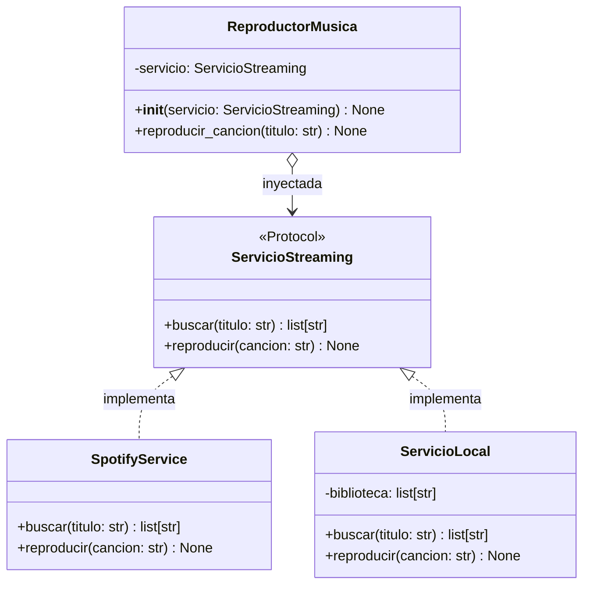

# Taller guiado — **Reproductor de Música con Inyección de Dependencias**

## Contexto y objetivo

Vas a construir un pequeño **reproductor de música** que puede conectarse a diferentes servicios de streaming (Spotify, una biblioteca local, etc.).

La clave del ejercicio es diseñarlo de modo que **cambiar de servicio no requiera modificar el reproductor**. Ese es exactamente el problema que resuelve la **Inyección de Dependencias**.

**Conceptos practicados:**
- `Protocol` como contrato estructural
- Inyección de dependencias por constructor
- Punto de ensamblaje (`main`)
- Intercambiabilidad de implementaciones

**Tiempo estimado:** 45 minutos  

---

## Diagrama de la solución



> **Nota sobre el diagrama:** La flecha `o-->` en `ReproductorMusica` indica que la dependencia
> llega desde afuera — el reproductor **no crea** el servicio, solo lo **usa**.

---

## Instrucciones generales

1. Trabaja el archivo **de arriba hacia abajo**, bloque por bloque.
2. **No avances al siguiente bloque** sin responder la pregunta de reflexión del bloque actual.
3. El bloque `main` al final ya está completo; solo ejecútalo para verificar tu solución.
4. **No modifiques** `SpotifyService` ni el bloque `main`.

---

## Bloque 0 — Diagnóstico: el código *sin* inyección de dependencias (5 min)

Lee el siguiente código. **No tienes que escribir nada aquí.**

```python
# ❌ Diseño sin inyección de dependencias
class ReproductorMusicaMalo:
    def __init__(self):
        self.servicio = SpotifyService()   # ← dependencia creada adentro

    def reproducir_cancion(self, titulo: str) -> None:
        resultados = self.servicio.buscar(titulo)
        if resultados:
            self.servicio.reproducir(resultados[0])
        else:
            print(f"No se encontró: {titulo}")
```

###  Reflexión 0 — escribe tu respuesta antes de continuar

> **Pregunta:** ¿Qué problema(s) tiene este diseño?
> ¿Qué tendrías que hacer si mañana quisieras usar `ServicioLocal` en lugar de `SpotifyService`?


---

## Bloque 1 — Define el contrato con `Protocol` (10 min)

Un `Protocol` describe **qué métodos debe tener** cualquier servicio de streaming,
sin importar cómo estén implementados.

**Tu tarea:** completa las dos firmas de método que faltan.

```python
# starter_reproductor.py
from typing import Protocol


# ── Bloque 1: contrato ──────────────────────────────────────────────────────

class ServicioStreaming(Protocol):
    """Contrato que debe cumplir cualquier servicio de streaming."""

    # TODO 1 — Declara el método buscar.
    #   - Recibe: titulo (str)
    #   - Retorna: list[str]  (lista de canciones que coinciden)
    def buscar(self, ...) -> ...:
        ...

    # TODO 2 — Declara el método reproducir.
    #   - Recibe: cancion (str)
    #   - Retorna: None
    #   - Solo necesita `...` como cuerpo (es un Protocol, no una clase base)
    def reproducir(self, ...) -> ...:
        ...
```

###  Reflexión 1

> **Pregunta:** ¿Por qué definimos `ServicioStreaming` como un `Protocol` en lugar de
> llamar directamente a `SpotifyService` desde `ReproductorMusica`?


---

## Bloque 2 — Implementa los servicios concretos (15 min)

### 2a — `SpotifyService` (ya está completa — solo léela)

```python
# ── Bloque 2a: servicio Spotify (completo — solo referencia) ─────────────────

class SpotifyService:
    """Simula un servicio de streaming en línea."""

    def buscar(self, titulo: str) -> list[str]:
        # Simulación: devuelve variantes del título
        return [
            f"{titulo} (Radio Edit)",
            f"{titulo} (Album Version)",
            f"{titulo} (Live)",
        ]

    def reproducir(self, cancion: str) -> None:
        print(f"[Spotify] ▶ Reproduciendo: {cancion}")
```

### 2b — `ServicioLocal` (completa los TODOs)

```python
# ── Bloque 2b: servicio local (tú lo implementas) ────────────────────────────

class ServicioLocal:
    """Reproduce canciones desde una biblioteca local (lista en memoria)."""

    def __init__(self, biblioteca: list[str]) -> None:
        # TODO 3 — Guarda la lista de canciones en un atributo privado _biblioteca
        ...

    def buscar(self, titulo: str) -> list[str]:
        # TODO 4 — Retorna todas las canciones de _biblioteca cuyo nombre
        #           contenga `titulo` (sin importar mayúsculas/minúsculas).
        #           Usa list comprehension.
        ...

    def reproducir(self, cancion: str) -> None:
        # TODO 5 — Imprime: [Local] ▶ Reproduciendo: <cancion>
        ...
```

###  Reflexión 2

> **Pregunta:** `SpotifyService` y `ServicioLocal` no heredan de ninguna clase.
> ¿Cómo sabe Python que ambos cumplen el contrato `ServicioStreaming`?
> ¿Qué pasaría si a `ServicioLocal` le faltara el método `reproducir`?


---

## Bloque 3 — Inyecta la dependencia en el reproductor (10 min)

Ahora construye `ReproductorMusica`. El servicio **no se crea aquí**; llega como parámetro.

```python
# ── Bloque 3: reproductor (tú lo implementas) ────────────────────────────────

class ReproductorMusica:
    """Reproduce música usando el servicio de streaming que se le inyecte."""

    def __init__(self, servicio: ServicioStreaming) -> None:
        # TODO 6 — Guarda el servicio en un atributo privado _servicio
        ...

    def reproducir_cancion(self, titulo: str) -> None:
        # TODO 7 — Usa _servicio para:
        #   1. Buscar canciones que coincidan con `titulo`
        #   2. Si hay resultados, reproducir el primero
        #   3. Si no hay resultados, imprimir: No se encontró: <titulo>
        ...
```

### 🔎 Reflexión 3

> **Pregunta:** ¿En qué parte del código se crea el objeto concreto
> (`SpotifyService` o `ServicioLocal`)?
> ¿Por qué **no** debe crearse dentro de `ReproductorMusica.__init__`?


---

## Bloque 4 — Ensamblaje y verificación (5 min)

El siguiente bloque `main` **ya está completo**. Ejecútalo una vez que hayas terminado
los TODOs 1–7. Si todo está bien, verás la salida esperada.

```python
# ── Bloque 4: punto de ensamblaje (completo — no modificar) ──────────────────

if __name__ == "__main__":

    # — Con Spotify —
    print("=== Spotify ===")
    reproductor_spotify = ReproductorMusica(SpotifyService())
    reproductor_spotify.reproducir_cancion("Bohemian Rhapsody")
    reproductor_spotify.reproducir_cancion("Cancion Inexistente En Spotify")

    print()

    # — Con biblioteca local —
    mi_biblioteca = [
        "Bohemian Rhapsody - Queen",
        "Hotel California - Eagles",
        "Stairway to Heaven - Led Zeppelin",
    ]
    print("=== Servicio Local ===")
    reproductor_local = ReproductorMusica(ServicioLocal(mi_biblioteca))
    reproductor_local.reproducir_cancion("bohemian")   # búsqueda case-insensitive
    reproductor_local.reproducir_cancion("Jazz")        # no existe
```

**Salida esperada:**

```
=== Spotify ===
[Spotify] ▶ Reproduciendo: Bohemian Rhapsody (Radio Edit)
No se encontró: Cancion Inexistente En Spotify

=== Servicio Local ===
[Local] ▶ Reproduciendo: Bohemian Rhapsody - Queen
No se encontró: Jazz
```

###  Reflexión 4 — pregunta clave del taller

> **Pregunta:** Para pasar de usar `SpotifyService` a `ServicioLocal`,
> ¿cuántas líneas de `ReproductorMusica` tuviste que cambiar?
> ¿Qué conclusión sacas de eso?


---

## Reto adicional (sin tiempo asignado)

Elige **uno** de los siguientes retos si terminas antes de tiempo:

### Opción A — Un tercer servicio

Crea `ServicioYouTubeMusic` que también cumpla el contrato `ServicioStreaming`.
- `buscar` devuelve resultados con el sufijo `"(YouTube Music)"`.
- `reproducir` imprime `[YT Music] ▶ Reproduciendo: <cancion>`.
- Agrégalo al bloque `main` con un tercer reproductor.

### Opción B — Segunda inyección: registro de actividad

Define un segundo Protocol `RegistroActividad` con un único método:

```python
def registrar(self, mensaje: str) -> None: ...
```

Crea dos implementaciones: `RegistroConsola` (imprime en pantalla) y
`RegistroSilencioso` (no hace nada — útil para pruebas).

Modifica `ReproductorMusica` para recibir **también** un `RegistroActividad` y
registrar cada canción que se reproduce.

---

## Resumen de TODOs

| # | Clase | Qué implementar |
|---|---|---|
| 1 | `ServicioStreaming` | Firma de `buscar` |
| 2 | `ServicioStreaming` | Firma de `reproducir` |
| 3 | `ServicioLocal` | Atributo `_biblioteca` |
| 4 | `ServicioLocal` | Método `buscar` con list comprehension |
| 5 | `ServicioLocal` | Método `reproducir` |
| 6 | `ReproductorMusica` | Guardar `_servicio` en constructor |
| 7 | `ReproductorMusica` | Método `reproducir_cancion` |
