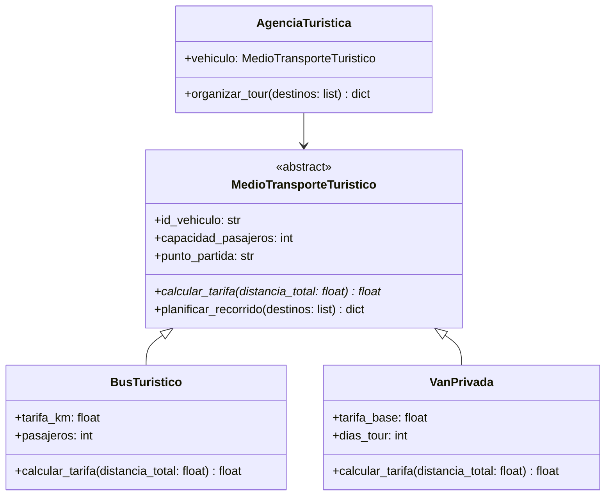

# Gestión de Rutas Turísticas Colombianas

Una agencia de turismo colombiana necesita desarrollar un sistema para planificar recorridos turísticos
entre los principales destinos del país. Cada tipo de vehículo turístico tiene una estructura de tarifas
diferente, y el sistema debe planificar las rutas y calcular las tarifas correspondientes.

Se te ha asignado la tarea de implementar el módulo de la lógica de negocio del sistema, con base en el
siguiente diseño:



Para la implementación de este módulo, debes tener en cuenta las siguientes instrucciones:

## Clase `MedioTransporteTuristico`

* Debe ser una clase abstracta.
* Tiene los atributos `id_vehiculo` de tipo `str`, `capacidad_pasajeros` de tipo `int` y
  `punto_partida` de tipo `str`. Los tres atributos son inicializados con parámetros en el constructor.
* Define un método abstracto (el que está en color azul en el diagrama)
  `calcular_tarifa` que recibe un parámetro `distancia_total` de tipo `float` y retorna un valor
  de tipo `float`.
* Define un método `planificar_recorrido` que recibe un parámetro `destinos` de tipo `list[str]` y
  retorna un valor de tipo `dict`. Este método debe calcular el recorrido turístico para los destinos
  recibidos, partiendo desde el `punto_partida` del vehículo. El método debe verificar que existan
  conexiones válidas en el diccionario de distancias. En caso de que no exista conexión entre dos
  destinos consecutivos, el método debe generar una excepción de tipo
  `DestinoTuristicoNoDisponibleError`.

  > **Pistas**
  > - La excepción `DestinoTuristicoNoDisponibleError` está definida en el módulo `errores`, el cual
  >   debes importar. Revisa su definición para saber cómo lanzarla; recibe como parámetro el destino
  >   que no tiene cobertura.
  > - Debes importar el diccionario `distancias` definido en el módulo `datos` para verificar las rutas.
  > - Para verificar si existe conexión entre dos destinos `A` y `B`, comprueba si la tupla `(A, B)` **o**
  >   la tupla `(B, A)` está en el diccionario de distancias.
  > - La distancia entre `A` y `B` puede estar guardada como `distancias[(A, B)]` o como `distancias[(B, A)]`.

  **Ejemplo:**
  Supongamos que el `punto_partida` del vehículo es `"Bogotá"` y que el listado de `destinos` es
  `["Medellín", "Salento"]`. <br/>
  <br/>
  Si el diccionario de distancias tiene la siguiente estructura:
  ```python
  distancias = {
    ("Bogotá", "Medellín"): 415,
    ("Medellín", "Salento"): 210,
    ("Salento", "Manizales"): 80,
  }
  ```

  El método `planificar_recorrido` debería retornar un diccionario con la siguiente estructura:
  ```python
  {
    "recorrido": ["Bogotá", "Medellín", "Salento"],
    "distancia_total": 625
  }
  ```

## Clase `BusTuristico`

* Debe heredar de la clase `MedioTransporteTuristico`.
* Tiene los atributos `tarifa_km` de tipo `float` y `pasajeros` de tipo `int`.
  Ambos atributos son inicializados con parámetros en el constructor (además de los atributos heredados).
* Implementa el método `calcular_tarifa` que calcula la tarifa total del recorrido en función de la
  distancia total recorrida (km) y el número de pasajeros. La tarifa se calcula con la fórmula:
  ```plaintext
  tarifa = distancia_total * tarifa_km + pasajeros * 15000
  ```
  Donde `15000` representa el costo fijo del seguro turístico por pasajero (en pesos colombianos).


## Clase `VanPrivada`

* Debe heredar de la clase `MedioTransporteTuristico`.
* Tiene los atributos `tarifa_base` de tipo `float` y `dias_tour` de tipo `int`.
  Ambos atributos son inicializados con parámetros en el constructor (además de los atributos heredados).
* Implementa el método `calcular_tarifa` que calcula la tarifa total del servicio de van privada.
  El costo incluye una tarifa base fija, el costo por kilómetro recorrido y el costo del conductor
  por día. La tarifa se calcula con la fórmula:
  ```plaintext
  tarifa = tarifa_base + distancia_total * 1200 + dias_tour * 200000
  ```
  Donde `1200` es el costo por kilómetro en van privada y `200000` es el pago diario del conductor
  (en pesos colombianos).


## `AgenciaTuristica`

Incorpora una herramienta concreta cuya responsabilidad sea **orquestar** la organización de un tour
a partir de un objeto `MedioTransporteTuristico` ya existente en el modelo (por ejemplo, un
`BusTuristico` o una `VanPrivada`).
La herramienta recibirá en su construcción una referencia a ese `MedioTransporteTuristico` y, a partir
de una lista de destinos, producirá un **resultado auto-contenido** con la información esencial del tour.
Se espera que dicho resultado sea un diccionario que incluya, al menos, la secuencia de destinos que
conforman el recorrido, la distancia total recorrida y la tarifa total a cobrar. Si el tour no puede
realizarse, debe reflejarse mediante el **mismo tipo de error** que el modelo ya utiliza para destinos
sin cobertura.

La implementación debe **apoyarse exclusivamente en la abstracción** ya definida.

> **Pistas para la implementación:**
> 1. En el constructor de `AgenciaTuristica`, guarda la referencia al `MedioTransporteTuristico`
>    recibido como atributo de la instancia (por ejemplo, `self.vehiculo = vehiculo`).
> 2. En el método `organizar_tour`, utiliza el método `planificar_recorrido` del vehículo para obtener
>    el recorrido y la distancia total (recuerda que el resultado es un diccionario).
> 3. Con la `distancia_total` obtenida, utiliza el método `calcular_tarifa` para calcular la tarifa
>    total del tour.
> 4. Construye y retorna un diccionario con los campos `"recorrido"`, `"distancia_total"` y
>    `"tarifa_total"`.
