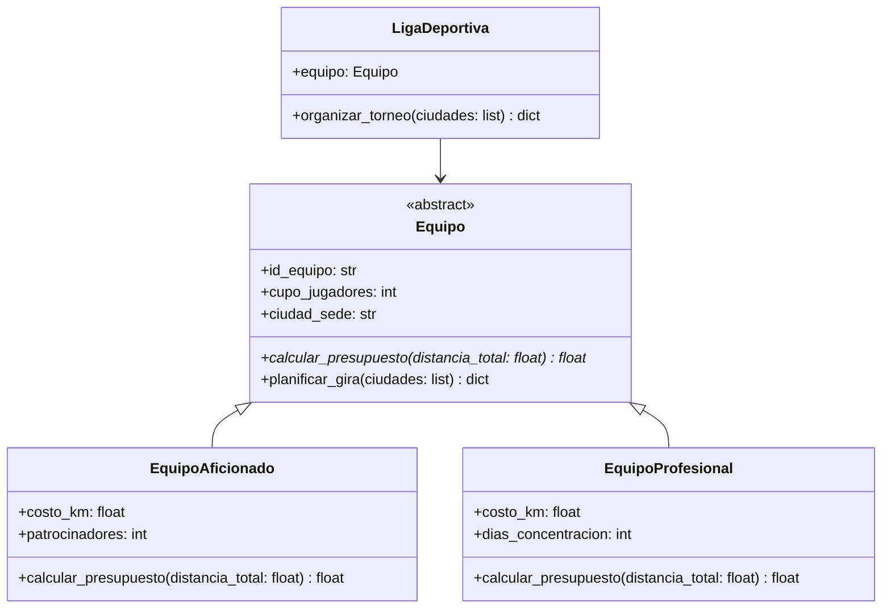

# Gestión de Torneos Deportivos

Una liga deportiva colombiana necesita desarrollar un sistema para planificar las giras de sus equipos
durante el torneo nacional. Cada tipo de equipo tiene una estructura de costos distinta dependiendo de
su categoría, y el sistema debe calcular las rutas de visita a las sedes rivales y estimar el presupuesto
requerido para cada gira.

Se te ha asignado la tarea de implementar el módulo de la lógica de negocio del sistema, con base en el
siguiente diseño:



Para la implementación de este módulo, debes tener en cuenta las siguientes instrucciones:

## Clase `Equipo`

* Debe ser una clase abstracta.
* Tiene los atributos `id_equipo` de tipo `str`, `cupo_jugadores` de tipo `int` y `ciudad_sede` de
  tipo `str`. Los tres atributos son inicializados con parámetros en el constructor.
* Define un método abstracto (el que está en color azul en el diagrama) `calcular_presupuesto` que
  recibe un parámetro `distancia_total` de tipo `float` y retorna un valor de tipo `float`.
* Define un método `planificar_gira` que recibe un parámetro `ciudades` de tipo `list[str]` y retorna
  un valor de tipo `dict`. Este método debe calcular la ruta de la gira visitando las ciudades recibidas,
  partiendo desde la `ciudad_sede` del equipo. El método debe verificar que existan conexiones válidas
  en el diccionario de distancias. En caso de que no exista conexión entre dos ciudades consecutivas,
  el método debe generar una excepción de tipo `SedeNoDisponibleError`.

  > **Pistas**
  > - La excepción `SedeNoDisponibleError` está definida en el módulo `errores`, el cual debes importar.
  >   Revisa su definición para saber cómo lanzarla; recibe como parámetro la ciudad que no está disponible.
  > - Debes importar la lista `distancias` definida en el módulo `datos` para verificar las rutas.
  > - La lista `distancias` contiene tuplas de la forma `(ciudad_a, ciudad_b, distancia_km)`. Una conexión
  >   entre `A` y `B` puede estar guardada como `(A, B, dist)` **o** como `(B, A, dist)`.
  > - Para buscar la distancia entre `A` y `B`, recorre la lista con un `for` desempaquetando cada
  >   tupla en tres variables (`a`, `b`, `dist`) y verifica ambas direcciones. Cuando encuentres la
  >   coincidencia, guarda la distancia y detén el ciclo con `break`.
  > - Inicializa la distancia en `None` antes del `for`. Si al terminar el ciclo sigue siendo `None`,
  >   la conexión no existe y debes lanzar la excepción.

  **Ejemplo:**
  Supongamos que la `ciudad_sede` del equipo es `"Bogotá"` y que la lista de `ciudades` es
  `["Medellín", "Cali"]`. <br/>
  <br/>
  Si la lista de distancias tiene la siguiente estructura:
  ```python
  distancias = [
    ("Bogotá", "Medellín", 415),
    ("Medellín", "Cali", 415),
  ]
  ```

  El método `planificar_gira` debería retornar un diccionario con la siguiente estructura:
  ```python
  {
    "gira": ["Bogotá", "Medellín", "Cali"],
    "distancia_total": 830
  }
  ```

## Clase `EquipoAficionado`

* Debe heredar de la clase `Equipo`.
* Tiene los atributos `costo_km` de tipo `float` y `patrocinadores` de tipo `int`.
  Ambos atributos son inicializados con parámetros en el constructor (además de los atributos heredados).
* Implementa el método `calcular_presupuesto` que calcula el presupuesto total de la gira en función
  de la distancia total recorrida y el número de patrocinadores del equipo. El presupuesto se calcula
  con la fórmula:
  ```plaintext
  presupuesto = distancia_total * costo_km + patrocinadores * 150000
  ```
  Donde `150000` representa el aporte fijo por cada patrocinador que cubre gastos logísticos
  (en pesos colombianos).


## Clase `EquipoProfesional`

* Debe heredar de la clase `Equipo`.
* Tiene los atributos `costo_km` de tipo `float` y `dias_concentracion` de tipo `int`.
  Ambos atributos son inicializados con parámetros en el constructor (además de los atributos heredados).
* Implementa el método `calcular_presupuesto` que calcula el presupuesto total de la gira. Los equipos
  profesionales deben realizar una concentración previa en cada tramo de 200 km de recorrido. El
  presupuesto se calcula con la fórmula:
  ```plaintext
  presupuesto = distancia_total * costo_km + (distancia_total // 200) * dias_concentracion * 80000
  ```
  Donde `distancia_total // 200` es el número de concentraciones requeridas durante la gira, y
  `80000` es el costo fijo por día de concentración (en pesos colombianos).


## `LigaDeportiva`

Incorpora una herramienta concreta cuya responsabilidad sea **orquestar** la participación de un equipo
en el torneo a partir de un objeto `Equipo` ya existente en el modelo (por ejemplo, un
`EquipoAficionado` o un `EquipoProfesional`).
La herramienta recibirá en su construcción una referencia a ese `Equipo` y, a partir de una lista de
ciudades sede, producirá un **resultado auto-contenido** con la información esencial del torneo.
Se espera que dicho resultado sea un diccionario que incluya, al menos, la secuencia de ciudades que
conforman la gira, la distancia total recorrida y el presupuesto total requerido. Si la gira no puede
realizarse, debe reflejarse mediante el **mismo tipo de error** que el modelo ya utiliza para sedes
no disponibles.

La implementación debe **apoyarse exclusivamente en la abstracción** ya definida.

> **Pistas para la implementación:**
> 1. En el constructor de `LigaDeportiva`, guarda la referencia al `Equipo` recibido como atributo
>    de la instancia (por ejemplo, `self.equipo = equipo`).
> 2. En el método `organizar_torneo`, utiliza el método `planificar_gira` del equipo para obtener
>    la gira y la distancia total (recuerda que el resultado es un diccionario).
> 3. Con la `distancia_total` obtenida, utiliza el método `calcular_presupuesto` para calcular
>    el presupuesto total de la gira.
> 4. Construye y retorna un diccionario con los campos `"gira"`, `"distancia_total"` y
>    `"presupuesto_total"`.
