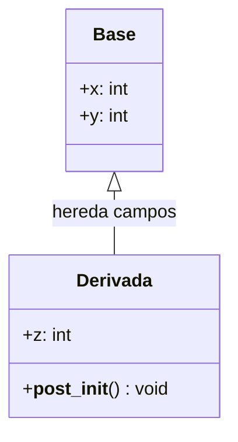
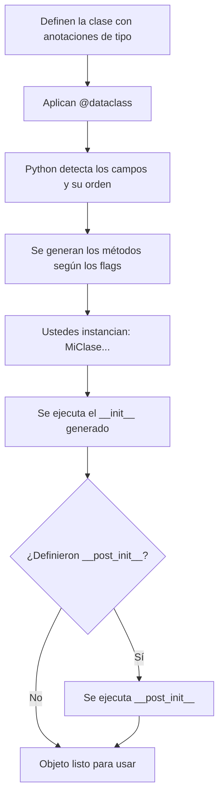

# Dataclasses en Python

## ¿De qué se trata esto?

Vamos a hablar de **dataclasses**. Imagínense esto: cada vez que crean una clase en Python para guardar datos, terminan escribiendo el mismo `__init__`, el mismo `__repr__`, el mismo `__eq__`... una y otra vez. Es tedioso, ¿verdad? Bueno, las dataclasses vinieron a salvarnos de esa repetición.

Una dataclass es simplemente una clase normal de Python, pero con un decorador `@dataclass` que le dice a Python: *"Oye, generame automáticamente esos métodos aburridos que siempre tengo que escribir"*. Nada más. No es magia, no es un tipo especial de objeto. Es una clase común y corriente con un atajo muy conveniente.

**¿Para qué sirven?** Para modelar datos con estructura clara: un estudiante con nombre y código, un producto con precio y cantidad, una coordenada con x e y. Básicamente, cuando la clase existe principalmente para **guardar información** y la lógica que tiene es poca o simple.

Ojo: las dataclasses **no validan tipos en tiempo de ejecución**. Que pongas `x: int` no significa que Python te va a gritar si le pasas un string. Eso es responsabilidad tuya.

Están disponibles desde Python 3.7, y en versiones posteriores (3.10, 3.11) se fueron agregando cosas interesantes como `slots`, `kw_only` y mejores protecciones contra defaults mutables.

---

## Sintaxis y conceptos clave

### ¿Qué es un "campo" en una dataclass?

Cuando decoran una clase con `@dataclass`, Python mira todas las variables que ustedes anotaron con tipo y las trata como **campos**. El orden en que los declaran importa: ese es el orden que va a tener el `__init__`, el `__repr__`, las comparaciones, todo.

```python
from dataclasses import dataclass

@dataclass
class Punto:
    x: float
    y: float
```

Con solo eso, Python les genera un `__init__()`, un `__repr__()` y un `__eq__()`. No tuvieron que escribir nada de eso. ¿Ven el poder?

Un par de cosas que siempre generan confusión al principio:

- `@dataclass` y `@dataclass()` son lo mismo si no pasan argumentos. Las dos formas funcionan.
- Normalmente el decorador modifica la misma clase, pero en algunos casos (como `slots=True`) crea una clase nueva por debajo. No se preocupen mucho por eso ahora.

### Los parámetros del decorador `@dataclass`

El decorador tiene varios parámetros que controlan qué se genera y qué no. Vamos uno por uno con los más importantes:

**`init` (por defecto `True`)**
Genera el `__init__()`. Si ustedes ya definieron un `__init__` a mano, este parámetro se ignora y no lo sobreescribe.

**`repr` (por defecto `True`)**
Genera un `__repr__()` bonito que muestra el nombre de la clase y todos los campos. Muy útil para hacer `print()` y entender qué tiene el objeto.

**`eq` (por defecto `True`)**
Genera `__eq__()`. Compara las instancias campo por campo, como si fueran tuplas. Importante: las dos instancias tienen que ser del **mismo tipo exacto** para que diga que son iguales.

**`order` (por defecto `False`)**
Si lo ponen en `True`, genera los métodos de comparación: `<`, `<=`, `>`, `>=`. Compara campo por campo en orden, igual que las tuplas. Tiene dos restricciones: necesita que `eq=True` (si no, lanza error), y si ya definieron algún método de comparación a mano, también lanza error.

**`frozen` (por defecto `False`)**
Este es interesante. Si lo ponen en `True`, la instancia no se puede modificar después de crearla. Cualquier intento de reasignar un atributo lanza un error. Es como decir "este objeto es de solo lectura". Ojo: no es inmutabilidad real al 100% (ya vamos a ver por qué), pero para la mayoría de los casos funciona perfecto.

**`kw_only` (Python 3.10+)**
Si es `True`, todos los campos se vuelven de **solo palabra clave** en el `__init__`. Es decir, ya no pueden instanciar la clase pasando argumentos por posición; tienen que usar `campo=valor`. Esto es muy útil cuando tienen muchos campos y quieren evitar errores por confundir el orden.

**`slots` (Python 3.10+)**
Si es `True`, genera `__slots__`. Esto ahorra memoria cuando van a crear muchas instancias y restringe la creación de atributos dinámicos. Es una optimización, no lo necesitan en la mayoría de los casos.

### Controlando campos individuales con `field()`

A veces necesitan más control sobre un campo específico. Para eso existe `field()`:

```python
from dataclasses import dataclass, field
```

Con `field()` pueden controlar cosas como:
- `default` y `default_factory`: valor por defecto del campo
- `init`: si el campo aparece o no en el `__init__`
- `repr`: si aparece en el `__repr__`
- `compare`: si se usa en comparaciones
- `kw_only`: si es keyword-only (solo ese campo específico)

Hay **dos reglas de oro** que deben grabarse:

1. **Regla de orden**: un campo con valor por defecto NO puede ir antes de un campo sin valor por defecto. Si lo hacen, Python les lanza un `TypeError`. Esto aplica también cuando hay herencia.
2. **Nada de defaults mutables**: no pongan `default=[]` o `default={}`. Usen `default_factory=list` o `default_factory=dict`. Ya vamos a ver por qué con ejemplos.

---

## ¿Y qué alternativas existen?

Antes de seguir, vale la pena que conozcan las alternativas para que entiendan dónde encajan las dataclasses:

### Clase tradicional (todo a mano)

La de toda la vida. Escriben `__init__`, `__repr__`, `__eq__`, todo manualmente. Funciona, pero es mucho código repetitivo. Para una clase con 5 campos, ya les da pereza.

### `collections.namedtuple`

Crea una tupla con campos nombrados. Es liviana en memoria y es inmutable (porque es una tupla), pero tiene trampas: se puede comparar "accidentalmente" con otra namedtuple que tenga el mismo número de campos aunque represente algo totalmente diferente. Además, como es iterable y desempacable, agregar campos puede romper código que dependía del orden.

### `typing.NamedTuple`

Es la versión moderna de namedtuple con soporte para type hints. Comparte los beneficios y limitaciones de namedtuple: sigue siendo una tupla por debajo.

### `attrs` (librería externa)

Es más poderosa que dataclasses: tiene validadores, convertidores, y más opciones de personalización. A cambio, es una dependencia externa. En la práctica: dataclasses cubren el 80% de los casos sin instalar nada; `attrs` es para cuando necesitan más.

**Mi recomendación para ustedes**: usen dataclasses. Son parte de la librería estándar, son simples, y para lo que estamos viendo en el curso son más que suficientes.

---

## Temas avanzados que sí importan

### Herencia entre dataclasses

Las dataclasses soportan herencia, y funciona bastante bien. El decorador recorre las clases padre, junta los campos de todas, y los ordena. La clase hija puede **sobreescribir** campos de la clase padre.

Pero cuidado con la regla de orden: si la clase padre tiene un campo con default y la hija agrega uno sin default, van a tener un `TypeError`. Esto es una fuente común de frustración y la forma de resolverlo es reorganizar los campos o usar `kw_only`.

### El problema de los defaults mutables

Este es un clásico de Python, no solo de dataclasses. Si ponen una lista como valor por defecto en el cuerpo de una clase, **todas las instancias comparten la misma lista**. Es decir, si modifican la lista en una instancia, se modifica en todas. Es un error que se ve mucho en código de principiantes.

La solución: `default_factory=list`. Esto crea una lista nueva para cada instancia.

Desde Python 3.11, el sistema es más protector: si detecta que pusieron un default que no es hasheable (como una lista o diccionario), les lanza un `ValueError` directamente. Es una red de seguridad.

### `__post_init__`: su mejor amigo para validación

El `__init__` generado por dataclasses llama automáticamente a un método llamado `__post_init__()` si ustedes lo definen. Esto es perfecto para:
- Validar datos (¿la edad es negativa? ¿el código está vacío?)
- Calcular campos derivados (area = alto * ancho)
- Normalizar datos (convertir strings a mayúsculas, etc.)

Un detalle importante: si la clase hereda de una clase que NO es dataclass, el `__init__` generado **no llama** al `__init__` del padre. Si necesitan eso, llámenlo ustedes dentro de `__post_init__` con `super().__init__(...)`.

### Funciones útiles del módulo

El módulo `dataclasses` trae funciones que les van a servir mucho:

- **`fields(obj)`**: devuelve la lista de campos de la dataclass. Útil para introspección.
- **`asdict(obj)`**: convierte el objeto a diccionario, recursivamente. Muy práctico para serialización y APIs.
- **`astuple(obj)`**: igual que `asdict` pero devuelve una tupla.
- **`replace(obj, **cambios)`**: crea una copia del objeto con algunos campos cambiados. Esto es especialmente útil con `frozen=True`, donde no pueden modificar el original.
- **`is_dataclass(obj)`**: pregunta si algo es una dataclass o instancia de una.

### Diagramas

**Herencia entre dataclasses**



**¿Qué pasa cuando instancian una dataclass?**



---

## Sobre rendimiento y limitaciones

No se obsesionen con el rendimiento. Las dataclasses son clases normales, no son lentas ni rápidas de forma especial. Pero hay cosas que vale la pena saber:

- `frozen=True` tiene una penalización pequeña porque el `__init__` no puede usar asignación directa.
- `asdict` y `astuple` hacen copias profundas (`deepcopy`) de todo lo que no sea dict/list/tupla/dataclass. Si tienen objetos complejos adentro, puede ser lento.
- `slots=True` les ahorra memoria si van a crear miles de instancias. Para 10 objetos, no van a notar diferencia.

**Regla práctica**: modelen con dataclasses por legibilidad. Si algún día un profiler les dice que hay un cuello de botella, ahí sí optimicen.

### Limitaciones que deben conocer

1. **No hay validación automática de tipos**: que pongan `edad: int` no impide que alguien pase `"hola"`. Si quieren validar, háganlo en `__post_init__()`.

2. **`frozen=True` no es inmutabilidad real**: bloquea reasignaciones de atributos, sí. Pero si un campo apunta a una lista, esa lista sigue siendo mutable. Python no puede garantizar inmutabilidad absoluta.

3. **Herencia con clases que no son dataclass**: el `__init__` generado no llama al `__init__` del padre si éste no es una dataclass. Tienen que hacerlo ustedes.

4. **Defaults mutables**: ya lo vimos. Usen `default_factory`. Siempre.

---

## Buenas prácticas

Les dejo las que considero más importantes:

- **Usen dataclasses para datos con estructura clara**: modelos donde importan los campos nombrados y la lógica es sencilla.
- **Pongan las validaciones en `__post_init__()`**: convertir strings, validar rangos, calcular campos derivados... todo ahí.
- **Siempre `default_factory` para mutables**. No me hagan repetirlo.
- **Piensen si su objeto es un "valor" o una "entidad"**: si representa un valor (como una coordenada o una moneda), consideren `frozen=True`. Así pueden usarlo como clave de diccionario.
- **Si el constructor tiene muchos campos, usen `kw_only=True`**: evita errores por confundir el orden de los argumentos.
- **Para serialización, usen `asdict`** pero sean conscientes de que es recursivo y usa `deepcopy`. Si necesitan JSON y tienen objetos como `datetime`, van a tener que hacer un paso adicional.

---

## Ejemplos paso a paso

Todos estos ejemplos se pueden ejecutar tal cual. Cuando algo requiere Python 3.10+, lo indico.

### Ejemplo básico: lo mínimo necesario

Quiero que vean qué se genera automáticamente con un `@dataclass` simple:

```python
from dataclasses import dataclass

@dataclass
class Estudiante:
    codigo: str
    nombre: str
    semestre: int

ana = Estudiante("A001", "Ana", 2)
ana2 = Estudiante("A001", "Ana", 2)
beto = Estudiante("B002", "Beto", 2)

print(ana)               # repr generado automáticamente
print(ana == ana2)       # True - eq compara campo por campo
print(ana == beto)       # False
```

Fíjense: no escribimos ni `__init__`, ni `__repr__`, ni `__eq__`. Todo eso se generó solo. El `repr` les muestra el nombre de la clase y todos los campos, y el `eq` compara campo por campo exigiendo que sean del mismo tipo.

### Ejemplo: defaults y la regla de orden

Veamos cómo funcionan los valores por defecto y qué pasa cuando violamos la regla de orden:

```python
from dataclasses import dataclass

@dataclass
class Curso:
    nombre: str
    creditos: int = 3  # valor por defecto

c = Curso("Programación II")
print(c)  # creditos va a ser 3

# Ahora veamos qué pasa si lo hacemos mal:
try:
    @dataclass
    class Malo:
        x: int = 0   # tiene default
        y: int       # NO tiene default -> esto está prohibido después de uno con default
except TypeError as e:
    print("TypeError esperado:", e)
```

La regla es simple: los campos con default van al final. Si un campo sin default queda después de uno con default, Python se queja. Y esto aplica también cuando hay herencia, así que ojo.

### Ejemplo: `default_factory` (listas independientes por instancia)

Este es uno de los más importantes. Presten atención:

```python
from dataclasses import dataclass, field

@dataclass
class Agenda:
    eventos: list[str] = field(default_factory=list)

a1 = Agenda()
a2 = Agenda()
a1.eventos.append("Parcial 1")

print(a1.eventos)   # ['Parcial 1']
print(a2.eventos)   # [] -> ¡NO se contaminó!
print(a1.eventos is a2.eventos)  # False -> son listas diferentes

# ¿Y si lo hacemos mal? (Python 3.11 lo detecta)
try:
    @dataclass
    class AgendaMala:
        eventos: list[str] = []   # NUNCA hagan esto
except ValueError as e:
    print("ValueError esperado:", e)
```

`default_factory=list` le dice a Python: "cada vez que crees una instancia, llama a `list()` para crear una lista nueva". Así cada objeto tiene su propia lista independiente.

### Ejemplo: `frozen=True` y `replace`

Cuando quieren un objeto que no se pueda modificar después de creado:

```python
from dataclasses import dataclass, replace

@dataclass(frozen=True)
class Coordenada:
    x: float
    y: float

p = Coordenada(1.0, 2.0)
print(p)

# Intentar modificarlo va a fallar:
try:
    p.x = 99.0
except Exception as e:
    print(type(e).__name__, "esperado:", e)

# Si necesitan una "versión modificada", usen replace:
p2 = replace(p, x=99.0)
print("Original:", p)    # no cambió
print("Copia:", p2)      # nueva instancia con x=99.0
```

`replace` es la forma correcta de "modificar" un objeto frozen: crea uno nuevo con los cambios que le indiquen.

### Ejemplo: herencia y sobreescritura de campos

```python
from dataclasses import dataclass
from typing import Any

@dataclass
class Base:
    x: Any = 15.0
    y: int = 0

@dataclass
class Derivada(Base):
    z: int = 10
    x: int = 15  # sobreescribe x de la base

d = Derivada()
print(d)
```

La clase derivada hereda los campos de la base y puede sobreescribirlos. El orden final de campos sigue el MRO (Method Resolution Order) de Python.

### Ejemplo: `kw_only` y `KW_ONLY` (Python 3.10+)

Cuando tienen muchos campos, esto evita errores por confundir posiciones:

```python
from dataclasses import dataclass, field, KW_ONLY
import inspect

@dataclass
class Registro:
    id: int
    _: KW_ONLY          # todo lo que venga después es keyword-only
    activo: bool = True
    etiqueta: str = "N/A"

sig = inspect.signature(Registro)
print("Firma __init__:", sig)

r = Registro(10, activo=False, etiqueta="demo")
print(r)

# También pueden hacerlo campo por campo:
@dataclass
class Evento:
    nombre: str
    cuando: str = field(kw_only=True, default="hoy")

print("Firma Evento:", inspect.signature(Evento))
print(Evento("Parcial", cuando="mañana"))
```

### Ejemplo: serialización a dict y JSON

Esto les va a servir mucho cuando trabajen con APIs o necesiten guardar datos:

```python
from dataclasses import dataclass, asdict
import json

@dataclass
class Punto:
    x: int
    y: int

@dataclass
class Poligono:
    nombre: str
    vertices: list[Punto]

tri = Poligono("triángulo", [Punto(0, 0), Punto(1, 0), Punto(0, 1)])

d = asdict(tri)  # convierte todo a dict, recursivamente
print(d)

# Como solo hay ints/strings/list/dict, podemos pasarlo directo a JSON:
s = json.dumps(d, ensure_ascii=False)
print(s)
```

`asdict` recorre recursivamente todas las dataclasses anidadas y las convierte a diccionarios. Muy conveniente, pero si tienen objetos raros adentro (como un `datetime`), van a tener que hacer un paso extra para serializarlos.

### Comparación visual: ¿cuánto código se ahorran?

Este script compara cuántas líneas necesitan con cada enfoque para hacer lo mismo:

```python
snippets = {
    "clase_normal": """
class Persona:
    def __init__(self, nombre, edad):
        self.nombre = nombre
        self.edad = edad

    def __repr__(self):
        return f"Persona(nombre={self.nombre!r}, edad={self.edad!r})"
""",
    "dataclass": """
from dataclasses import dataclass

@dataclass
class Persona:
    nombre: str
    edad: int
""",
    "namedtuple": """
from collections import namedtuple
Persona = namedtuple("Persona", ["nombre", "edad"])
""",
    "attrs": """
import attrs

@attrs.define
class Persona:
    nombre: str
    edad: int
""",
}

def loc(s: str) -> int:
    return sum(1 for line in s.strip().splitlines() if line.strip())

pairs = [(k, loc(v)) for k, v in snippets.items()]
pairs.sort(key=lambda x: x[1])

max_loc = max(n for _, n in pairs)

for name, n in pairs:
    bar = "█" * int(40 * n / max_loc)
    print(f"{name:12} {n:2d} | {bar}")
```

Más barras = más líneas para lograr lo mismo. La clase normal siempre pierde. Pero recuerden: cada alternativa tiene sus propios tradeoffs.

---

## Ejercicios para practicar

### Ejercicio 1: Carrito de compras con `default_factory`

**Enunciado**: Modelen un `Carrito` con:
- `usuario: str`
- `items: list[str]` que empiece vacío por instancia
- un método `agregar(item)` que añada un item

Creen dos carritos y demuestren que no comparten la misma lista.

**Solución**

```python
from dataclasses import dataclass, field

@dataclass
class Carrito:
    usuario: str
    items: list[str] = field(default_factory=list)

    def agregar(self, item: str) -> None:
        self.items.append(item)

c1 = Carrito("ana")
c2 = Carrito("beto")

c1.agregar("teclado")
print(c1.items)   # ['teclado']
print(c2.items)   # []
print(c1.items is c2.items)  # False
```

### Ejercicio 2: Objeto inmutable con copias controladas

**Enunciado**: Creen una dataclass `Moneda` con `codigo: str` y `tasa: float` que sea inmutable. Luego hagan una función `actualizar_tasa(moneda, nueva_tasa)` que devuelva una nueva instancia con la tasa actualizada.

**Solución**

```python
from dataclasses import dataclass, replace

@dataclass(frozen=True)
class Moneda:
    codigo: str
    tasa: float

def actualizar_tasa(m: Moneda, nueva_tasa: float) -> Moneda:
    return replace(m, tasa=nueva_tasa)

usd = Moneda("USD", 1.0)
usd2 = actualizar_tasa(usd, 1.05)
print(usd, usd2)
```

### Ejercicio 3: Herencia simple

**Enunciado**: Creen `Persona(nombre, edad)` y `Estudiante` que herede de `Persona` y agregue `codigo` y `semestre=2`. Asegúrense de que no viola la regla de orden de defaults.

**Solución**

```python
from dataclasses import dataclass

@dataclass
class Persona:
    nombre: str
    edad: int

@dataclass
class Estudiante(Persona):
    codigo: str
    semestre: int = 2  # default al final, como debe ser

e = Estudiante("Ana", 19, "A001")
print(e)
```

Recuerden: los campos con defaults van al final. Como `Persona` no tiene defaults, podemos agregar uno en `Estudiante` sin problemas.

### Ejercicio 4: `__post_init__` para campos calculados

**Enunciado**: Definan `Rectangulo(alto, ancho)` y agreguen un campo `area` que se calcule automáticamente pero que NO aparezca en el `__init__`.

**Solución**

```python
from dataclasses import dataclass, field

@dataclass
class Rectangulo:
    alto: float
    ancho: float
    area: float = field(init=False)

    def __post_init__(self):
        self.area = self.alto * self.ancho

r = Rectangulo(2.0, 3.0)
print(r.area)  # 6.0
```

`field(init=False)` saca el campo del constructor, y `__post_init__` lo calcula a partir de los otros campos.

### Ejercicio 5: Serialización a JSON

**Enunciado**: Modelen `Punto` y `Ruta(nombre, puntos)` y conviertan una ruta a JSON.

**Solución**

```python
from dataclasses import dataclass, asdict
import json

@dataclass
class Punto:
    x: int
    y: int

@dataclass
class Ruta:
    nombre: str
    puntos: list[Punto]

ruta = Ruta("camino", [Punto(0, 0), Punto(3, 4)])
payload = asdict(ruta)
print(json.dumps(payload, ensure_ascii=False))
```

---

## Preguntas para pensar

Estas son preguntas que les podrían caer en un examen o que vale la pena que se hagan ustedes mismos:

1. ¿Qué métodos se generan por defecto con `@dataclass` y cómo se controla con los parámetros `init`, `repr`, `eq` y `order`?
2. ¿Por qué `default_factory` es la solución correcta para valores por defecto mutables? Expliquen el problema con un ejemplo.
3. ¿Qué diferencia hay entre `frozen=True` e inmutabilidad real? Den un ejemplo de un objeto "frozen" que contenga una referencia mutable.
4. En herencia, ¿cómo se determina el orden final de los campos? ¿Qué pasa si una clase hija sobreescribe un campo?
5. ¿Qué hace `asdict` con objetos anidados y por qué puede ser costoso?
6. (Python 3.10+) ¿Cómo funcionan los campos "keyword-only"? ¿Por qué existen?

---

## Errores comunes (y cómo solucionarlos)

Les dejo los errores que más veo en clase y cómo resolverlos:

**`TypeError: non-default argument follows default argument`**
Violaron la regla de orden. Un campo sin default quedó después de uno con default. Reorganicen los campos o usen `kw_only`.

**`ValueError` al poner `[]` o `{}` como default**
Están usando un mutable como valor por defecto. La solución es `field(default_factory=list)` o `field(default_factory=dict)`.

**"No se llama mi `__post_init__`"**
Revisen si usaron `@dataclass(init=False)` o si definieron un `__init__` a mano. Si el `__init__` generado no existe, `__post_init__` no se llama automáticamente.

**Errores raros en herencia con clases que no son dataclass**
El `__init__` generado no llama al `__init__` de una clase padre normal. Solución: llamen `super().__init__()` dentro de `__post_init__()`.

**`ValueError` al usar `order=True`**
Necesitan que `eq=True` también. Y si ya tienen definido algún método de comparación a mano, hay conflicto. Decidan: o dejan que dataclasses maneje las comparaciones, o las hacen ustedes. No las dos cosas.

**`asdict` es lento o produce estructuras enormes**
Es porque recorre todo recursivamente y hace `deepcopy`. Si solo necesitan un diccionario plano, pueden armar uno ustedes con `fields()` en lugar de usar `asdict`.

---

## Para profundizar

Si quieren ir más allá de lo que vimos en clase:

- **Documentación oficial del módulo `dataclasses`** (Python docs): la referencia completa con todos los detalles técnicos.
- **PEP 557**: el documento que propuso las dataclasses. Explica la motivación, las comparaciones con `namedtuple` y `attrs`, y las decisiones de diseño.
- **"What's New in Python 3.10"** (sección de dataclasses): para entender `slots` y `kw_only`.
- **Documentación de `attrs`**: si quieren ver qué ofrece una librería más completa. Busquen la sección "Why not Data Classes?" para una comparación honesta.
